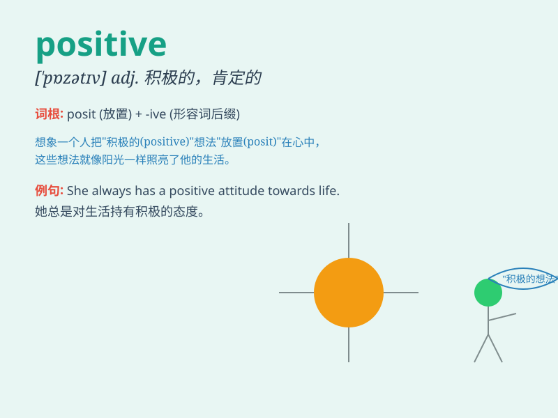

## positive

**英音:** _[ˈpɒzətɪv]_ **美音:** _[\'pɑzətɪv]_

**译义:**
*adj.肯定的,实际的,积极的,绝对的,确实的adj.[数]正的adj.[电]阳的adj.[语法]
原级的*

### 短语

+ **positive attitude:** _积极的态度_

+ **positive feedback:** _积极的反馈_

+ **positive result:** _积极的结果_

+ **positive influence:** _积极的影响_

+ **positive thinking:** _积极的思考_

### 例句

#### 例句1

> **She always has a positive attitude towards life.**

**中文翻译:** 她对待生活总是有积极的态度。

**单词释义:** 积极的

#### 例句2

> **The test result was positive.**

**中文翻译:** 测试结果是阳性的。

**单词释义:** 阳性的；肯定的

#### 例句3

> **We need to take positive action to solve the problem.**

**中文翻译:** 我们需要采取积极的行动来解决这个问题。

**单词释义:** 积极的

### 背诵小故事

> A young artist always faced rejections. But he held a positive
attitude. He kept painting and finally got recognized. His positive
spirit led to his success.

**一位年轻的艺术家总是遭遇拒绝。但他保持积极的态度。他坚持作画，最终得到认可。他的积极精神促成了他的成功。**

### 图义

