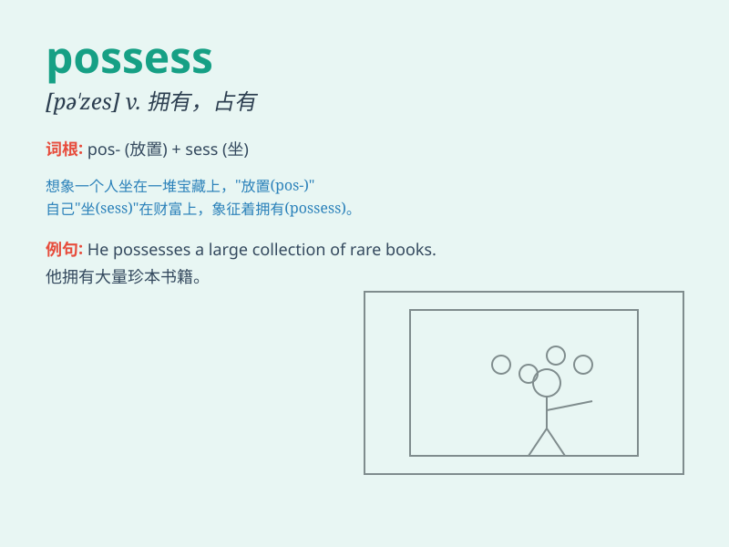

## possess

**英音:** _[pə\'zes]_ **美音:** _[pə\'zɛs]_

**译义:** *vt.占有,拥有,持有,摆布,支配*

### 短语

+ **possess oneself of:** _占有；获得_

+ **possess of:** _拥有；具有_

+ **be possessed by:** _被\...迷住；被\...附身_

+ **be possessed with:** _被\...缠住；满脑子都是_

+ **possess great wealth:** _拥有巨大的财富_

### 例句

#### 例句1

> **She possesses a rare talent for music.**

**中文翻译:** 她拥有罕见的音乐天赋。

**单词释义:** 拥有

#### 例句2

> **The museum possesses a collection of ancient coins.**

**中文翻译:** 这个博物馆拥有一批古钱币收藏。

**单词释义:** 拥有

#### 例句3

> **He was possessed by the desire to win.**

**中文翻译:** 他被获胜的欲望所支配。

**单词释义:** 被......支配

### 背诵小故事

> A brave knight was on a quest. He found a magical sword that could
possess the power to defeat all evil. With this possession, he became
the hero of the land. The sword was his most valuable asset.

**一位勇敢的骑士正在进行探索。他发现了一把有魔力的剑，这把剑能够拥有打败所有邪恶的力量。拥有了这把剑，他成为了这片土地的英雄。这把剑是他最宝贵的财产。**

### 图义

