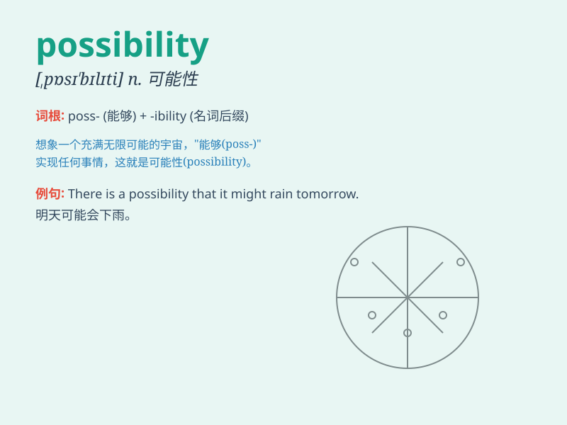

## possibility

**英音:** _[,pɒsɪ\'bɪlɪtɪ]_ **美音:** _[,pɑsə\'bɪləti]_

**译义:** *n.可能性,可能发生的事物*

### 短语

+ **possibility of:** _\...\...的可能性_

+ **remote possibility:** _极小的可能性_

+ **possibility that:** _\...\...的可能性_

+ **explore the possibility:** _探索可能性_

+ **rule out the possibility:** _排除可能性_

### 例句

#### 例句1

> **There is a possibility that it will rain tomorrow.**

**中文翻译:** 明天有可能会下雨。

**单词释义:** 可能性

#### 例句2

> **We should consider all the possibilities before making a
decision.**

**中文翻译:** 在做决定之前，我们应该考虑所有的可能性。

**单词释义:** 可能性

#### 例句3

> **The possibility of finding a cure for this disease is still
remote.**

**中文翻译:** 找到治愈这种疾病的可能性仍然渺茫。

**单词释义:** 可能性

### 背诵小故事

> One day, a little boy dreamed of traveling around the world. His
parents told him it was a possibility if he worked hard and saved money.
With this hope in mind, he started to plan for his future adventure.

**有一天，一个小男孩梦想着环游世界。他的父母告诉他，如果他努力工作并存钱，这是有可能的。怀着这个希望，他开始为未来的冒险做计划。**

### 图义

