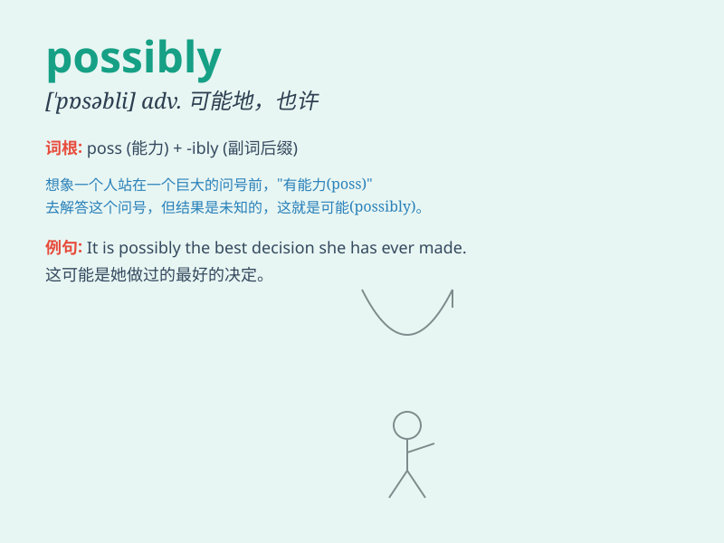

## possibly

**英音:** _[\'pɒsɪblɪ]_ **美音:** _[\'pɑsəbli]_

**译义:** *adv.可能地,或者*

### 短语

+ **possibly ever:** _可能曾经_

+ **possibly true:** _可能是真的_

+ **as possibly as:** _尽可能_

+ **possibly could:** _可能会_

+ **possibly not:** _可能不_

### 例句

#### 例句1

> **Possibly he will come tomorrow.**

**中文翻译:** 他可能明天来。

**单词释义:** 可能

#### 例句2

> **I can\'t possibly lend you so much money.**

**中文翻译:** 我不可能借给你这么多钱。

**单词释义:** 可能

#### 例句3

> **This is possibly the best movie of the year.**

**中文翻译:** 这可能是今年最好的电影。

**单词释义:** 可能

### 背诵小故事

> One day, Tom was asked if he could finish the project on time. He
answered, \'Possibly, but I need more resources.\' It means there was a
chance he could do it.

**一天，汤姆被问到是否能按时完成项目。他回答："可能吧，但我需要更多的资源。"
这意味着他有完成的机会。**

### 图义

