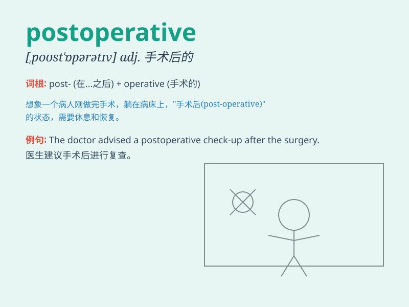

## postoperative

**英音:** _[ˌpəʊst ˈɒpərətɪv]_ **美音:** _[ˌpoʊst
ˈɑːpərətɪv]_

**译义:** *adj.手术后的*

### 短语

+ **postoperative care:** _术后护理_

+ **postoperative period:** _术后时期_

+ **postoperative complication:** _术后并发症_

+ **postoperative recovery:** _术后恢复_

+ **postoperative pain:** _术后疼痛_

### 例句

#### 例句1

> **The patient made a smooth postoperative recovery.**

**中文翻译:** 患者术后恢复顺利。

**单词释义:** 术后的

#### 例句2

> **Postoperative care is crucial for the patient\'s well-being.**

**中文翻译:** 术后护理对于患者的健康至关重要。

**单词释义:** 术后的

#### 例句3

> **The doctor prescribed some medications for postoperative
pain.**

**中文翻译:** 医生开了一些治疗术后疼痛的药物。

**单词释义:** 术后的

### 背诵小故事

> A patient was very worried about the postoperative period. But the
doctor assured him that with proper care, he would recover soon.
\'Postoperative\' means the time after a surgery.

**一位病人对术后阶段非常担忧。但医生向他保证，只要护理得当，他很快就会康复。'postoperative'意思是手术后的。**

### 图义

