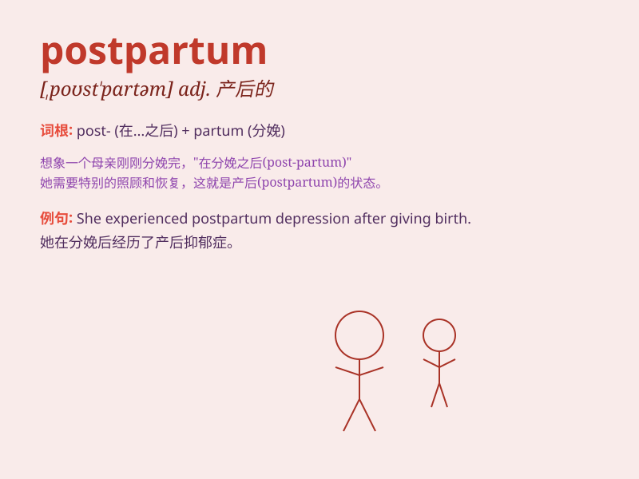

## postpartum

**英音:** _[\'pəʊst\'pɑːtəm]_ **美音:**
_[,post\'pɑrtəm]_

**译义:** *adj.产后的*

### 短语

+ **postpartum depression:** _产后抑郁症_

+ **postpartum hemorrhage:** _产后出血_

+ **postpartum care:** _产后护理_

+ **postpartum period:** _产后期_

+ **postpartum recovery:** _产后恢复_

### 例句

#### 例句1

> **The postpartum period can be challenging for new mothers.**

**中文翻译:** 对于新妈妈来说，产后时期可能充满挑战。

**单词释义:** 产后的

#### 例句2

> **She is experiencing postpartum depression.**

**中文翻译:** 她正在经历产后抑郁症。

**单词释义:** 产后的

#### 例句3

> **Postpartum care is essential for the mother\'s recovery.**

**中文翻译:** 产后护理对于妈妈的康复至关重要。

**单词释义:** 产后的

### 背诵小故事

> A new mother was very tired in the postpartum period. But with the
care of her family, she gradually recovered and adapted to her new role.
\'Postpartum\' refers to the time after giving birth.

**一位新妈妈在产后时期非常疲惫。但在家人的照顾下，她逐渐恢复并适应了新角色。'postpartum'指的是分娩后的时期。**

### 图义

