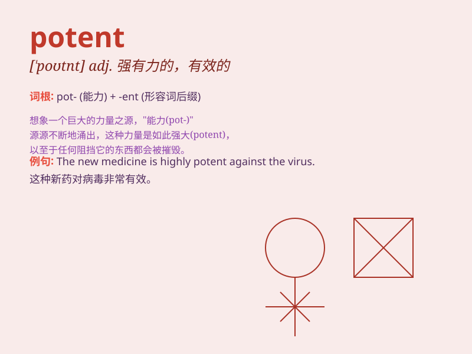

## potent

**英音:** _[\'pəʊt(ə)nt]_ **美音:** _[\'potnt]_

**译义:** *adj.有力的,有效的*

### 短语

+ **potent drug:** _强效药物_

+ **potent force:** _强大的力量_

+ **potent influence:** _强大的影响_

+ **potent argument:** _有力的论据_

+ **potent reminder:** _深刻的提醒_

### 例句

#### 例句1

> **The medicine is very potent and should be taken in small
doses.**

**中文翻译:** 该药非常有效，应小剂量服用。

**单词释义:** 强有力的；有效的

#### 例句2

> **He has a potent influence on the decisions of the board.**

**中文翻译:** 他对董事会的决定有强大的影响力。

**单词释义:** 有影响力的

#### 例句3

> **The new law is a potent weapon against crime.**

**中文翻译:** 新法律是打击犯罪的有力武器。

**单词释义:** 强有力的；有效的

### 背诵小故事

> A king had a potent magic staff. With it, he could solve any problem
and protect his kingdom. The staff was so powerful that no enemy dared
to attack. \'Potent\' means having great power or strength.

**一位国王有一根强大的魔法权杖。凭借它，国王能够解决任何问题并保护他的王国。这根权杖威力巨大，没有敌人敢来进犯。\'potent\'意思是有强大的力量或效力。**

### 图义

