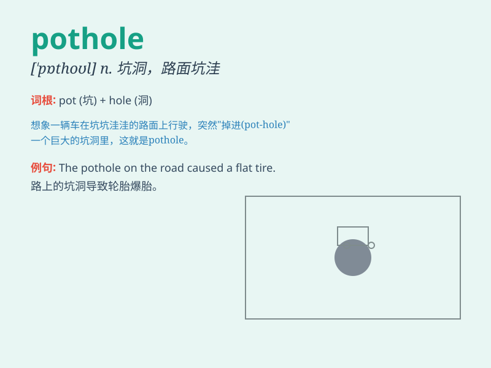

## pothole

**英音:** _[\'pɒthəʊl]_ **美音:** _[\'pɑthol]_

**译义:** *n.[地]壶穴*

### 短语

+ **fill a pothole:** _填补坑洼_

+ **avoid a pothole:** _避开坑洞_

+ **repair a pothole:** _修复坑洼_

+ **hit a pothole:** _撞上坑洞_

+ **pothole damage:** _坑洞造成的损害_

### 例句

#### 例句1

> **The car hit a pothole and the tyre burst.**

**中文翻译:** 汽车撞到坑洼，轮胎爆了。

**单词释义:** 坑洞

#### 例句2

> **The road was full of potholes after the heavy rain.**

**中文翻译:** 大雨过后，道路坑坑洼洼。

**单词释义:** 坑洞

#### 例句3

> **The cyclists had to be careful to avoid the potholes.**

**中文翻译:** 骑自行车的人必须小心避开坑洼。

**单词释义:** 坑洞

### 背诵小故事

> One day, I was riding my bike. Suddenly, the wheel got stuck in a
pothole. I fell off and hurt myself. A pothole is like a big hole in the
road that can cause problems for traffic and people.

**有一天，我正在骑自行车。突然，车轮卡在了一个坑洞里。我摔了下来并受伤了。坑洞就像是道路上的大洞，会给交通和行人带来麻烦。**

### 图义

