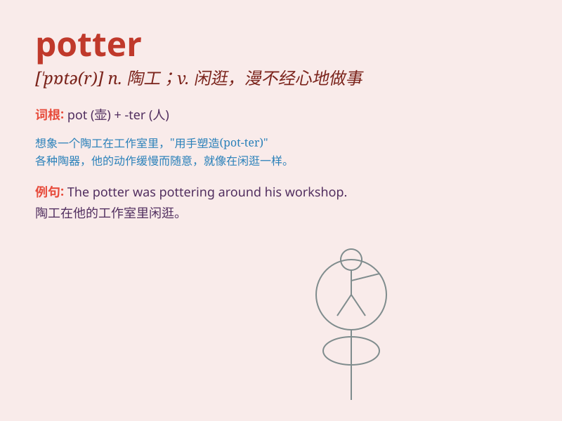

## potter

**英音:** _[\'pɒtə]_ **美音:** _[\'pɑtɚ]_

**译义:** *n.陶工,制陶工人*

### 短语

+ **potter about:** _闲逛；闲荡_

+ **potter around:** _无目的地闲逛；闲混_

+ **a potter\'s wheel:** _陶轮_

+ **potter\'s clay:** _陶土_

+ **potter\'s field:** _墓地；无名墓地_

### 例句

#### 例句1

> **The potter carefully shaped the clay on the wheel.**

**中文翻译:** 陶工在轮子上仔细地塑造粘土的形状。

**单词释义:** 陶工

#### 例句2

> **She spent the afternoon pottering in the garden.**

**中文翻译:** 她整个下午都在花园里闲逛。

**单词释义:** 闲逛；虚度时光

#### 例句3

> **The old man pottered around his workshop all day.**

**中文翻译:** 这位老人整天在他的工作室里闲逛。

**单词释义:** 闲转悠

### 背诵小故事

> One day, a little boy named Tom was playing in the garden. He saw a
potter making beautiful pots. The potter was very skillful and Tom was
amazed. From then on, Tom remembered the word \'potter\' which means a
person who makes pots.

**有一天，一个叫汤姆的小男孩在花园里玩耍。他看到一个陶工正在制作漂亮的罐子。这个陶工技艺精湛，汤姆感到很惊讶。从那以后，汤姆记住了'potter'这个词，意思是制作罐子的人。**

### 图义

