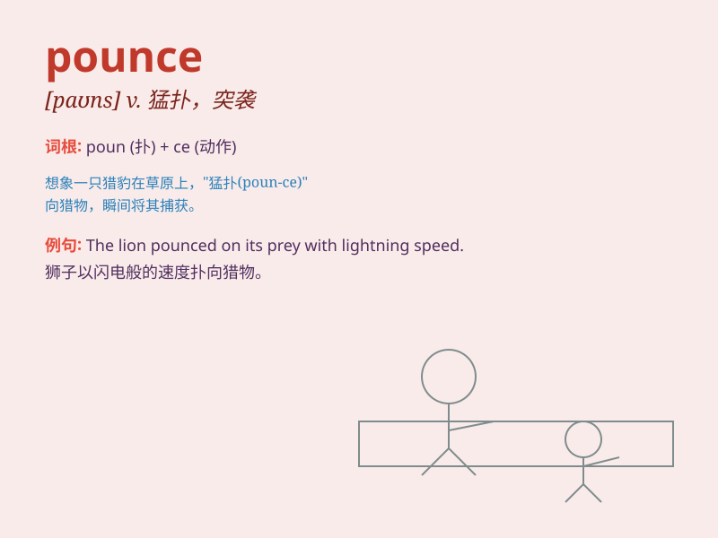

## pounce

**英音:** _[paʊns]_ **美音:** _[paʊns]_

**译义:** *v.突袭n.突袭*

### 短语

+ **pounce on:** _猛扑；突然袭击_

+ **pounce at:** _向\...猛扑_

+ **pounce upon:** _抓住；猛扑向_

+ **be ready to pounce:** _准备猛扑；准备突然行动_

+ **pounce into action:** _突然采取行动_

### 例句

#### 例句1

> **The cat pounced on the mouse.**

**中文翻译:** 猫扑向老鼠。

**单词释义:** 猛扑

#### 例句2

> **He pounced on the opportunity to go abroad.**

**中文翻译:** 他抓住了出国的机会。

**单词释义:** 抓住（机会）

#### 例句3

> **The police pounced as soon as the thief showed up.**

**中文翻译:** 小偷一出现，警察就出动了。

**单词释义:** 猛扑

### 背诵小故事

> 一只小猫咪看到一只老鼠从洞口窜出，它立刻 pounce
过去，猛地一扑，成功抓住了老鼠。这里的 pounce
就是猛扑、突袭的意思，就像小猫咪快速而突然的动作一样。

**一只小猫咪看到老鼠后立刻猛扑过去抓住它，以此解释'pounce'（猛扑、突袭）这个单词**

### 图义

