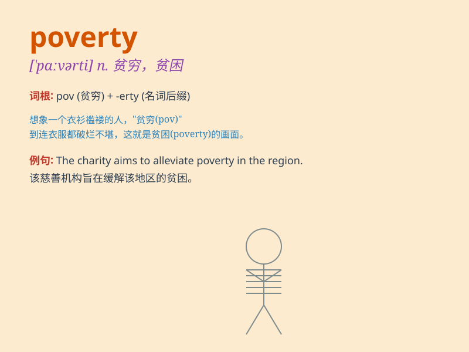

## poverty

**英音:** _[\'pɒvətɪ]_ **美音:** _[\'pɑvɚti]_

**译义:** *n.贫穷,贫困,贫乏,缺少*

### 短语

+ **poverty line:** _贫困线_

+ **extreme poverty:** _极端贫困_

+ **poverty alleviation:** _扶贫_

+ **live in poverty:** _生活在贫困中_

+ **poverty-stricken:** _贫困的；贫穷的_

### 例句

#### 例句1

> **He grew up in poverty but managed to achieve great success.**

**中文翻译:** 他出身贫寒，却取得了巨大的成功。

**单词释义:** 贫困；贫穷

#### 例句2

> **The government is taking measures to reduce poverty.**

**中文翻译:** 政府正在采取措施减少贫困。

**单词释义:** 贫困；贫穷

#### 例句3

> **Poverty forced her to drop out of school.**

**中文翻译:** 贫困迫使她辍学。

**单词释义:** 贫困；贫穷

### 背诵小故事

> A poor boy named Tom lived in a small village. He had no nice clothes
or enough food. His life was full of hardship, which showed the meaning
of \'poverty\'.

**一个叫汤姆的穷孩子住在一个小村庄里。他没有漂亮的衣服，也没有足够的食物。他的生活充满了艰难，这体现了'poverty（贫困）'的含义。**

### 图义

