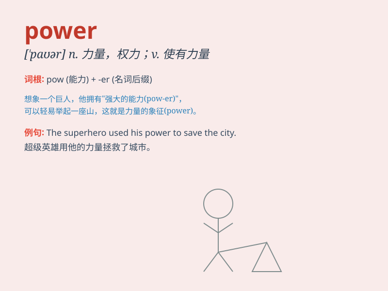

## power

**英音:** _[\'paʊə]_ **美音:** _[\'paʊɚ]_

**译义:**
*n.能力,力量,动力,权力,[数]幂,[物]功率vt.使\...有力量,供以动力,激励*

### 短语

+ **power station:** _发电站；发电厂_

+ **power supply:** _电源；供电_

+ **solar power:** _太阳能_

+ **nuclear power:** _核能_

+ **wind power:** _风力；风能_

### 例句

#### 例句1

> **The power of nature is astonishing.**

**中文翻译:** 自然的力量是惊人的。

**单词释义:** 力量

#### 例句2

> **She has the power to make decisions.**

**中文翻译:** 她有权力做决定。

**单词释义:** 权力

#### 例句3

> **The machine is powered by electricity.**

**中文翻译:** 该机器由电力驱动。

**单词释义:** 驱动；提供动力

### 背诵小故事

> A king had great power. He could decide the fate of his people. But
with power comes responsibility. He used his power wisely to make the
kingdom prosperous and happy.

**一位国王拥有强大的权力。他能决定他子民的命运。但权力也伴随着责任。他明智地运用权力让王国繁荣幸福。**

### 图义

