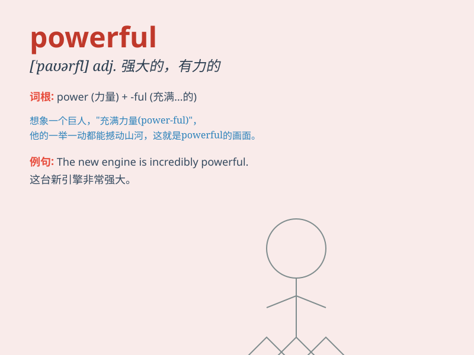

## powerful

**英音:** _[\'paʊəfʊl; -f(ə)l]_ **美音:** _[\'paʊɚfl]_

**译义:** *adj.强大的,有力的*

### 短语

+ **powerful engine:** _强大的引擎_

+ **powerful force:** _强大的力量_

+ **powerful impact:** _强大的影响_

+ **powerful drug:** _强效药物_

+ **powerful country:** _强国_

### 例句

#### 例句1

> **The new car has a powerful engine.**

**中文翻译:** 这辆新车有一个强大的发动机。

**单词释义:** 强大的；强有力的

#### 例句2

> **She is a powerful speaker and can convince anyone.**

**中文翻译:** 她是一位强大的演说家，可以说服任何人。

**单词释义:** 有影响力的

#### 例句3

> **The storm was so powerful that it knocked down many trees.**

**中文翻译:** 暴风雨威力如此之大，吹倒了许多树木。

**单词释义:** 强大的；剧烈的

### 背诵小故事

> Once upon a time, a small car had a powerful engine. It could run
very fast and climb steep hills easily. With this powerful engine, the
car became a hero on the road.

**从前，有一辆小汽车有一个强大的发动机。它能跑得非常快，轻松爬上陡峭的山坡。凭借这个强大的发动机，这辆车成了路上的英雄。**

### 图义

