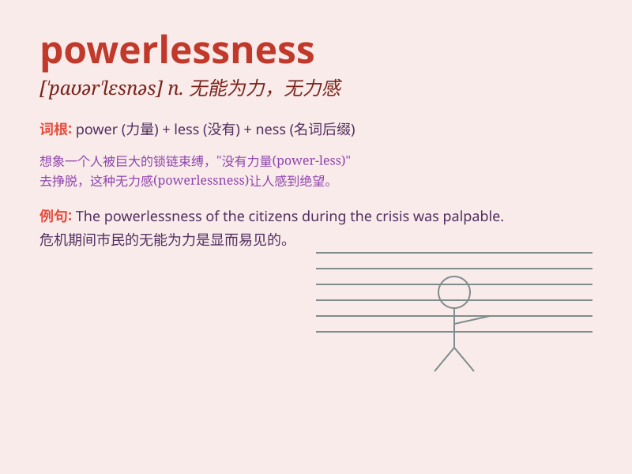

## powerlessness

**英音:** _[ˈpaʊələsnəs]_ **美音:** _[ˈpaʊərləsnəs]_

**译义:** *n.无能为力；无力量；无权力*

### 短语

+ **sense of powerlessness:** _无力感；无能为力感_

+ **fall into powerlessness:** _陷入无力状态_

+ **overcome powerlessness:** _克服无力感_

+ **experience powerlessness:** _经历无力_

+ **be trapped in powerlessness:** _被困于无力之中_

### 例句

#### 例句1

> **The feeling of powerlessness overwhelmed him when he couldn\'t
save his friend.**

**中文翻译:** 当他无法拯救他的朋友时，无能为力的感觉淹没了他。

**单词释义:** 无能为力；无力感

#### 例句2

> **She was trapped in a state of powerlessness after losing her
job.**

**中文翻译:** 她失业后陷入了一种无能为力的状态。

**单词释义:** 无力；无奈

#### 例句3

> **The powerlessness of the small country in the face of the
economic crisis was obvious.**

**中文翻译:** 这个小国在面对经济危机时的无能为力是显而易见的。

**单词释义:** 无力；无能

### 背诵小故事

> Once upon a time, a little mouse felt powerlessness when facing a big
cat. It tried to run but couldn\'t escape. This showed how weak and
helpless it was, just like the meaning of \'powerlessness\'.

**从前，一只小老鼠面对一只大猫时感到无能为力。它试图逃跑但无法逃脱。这展现了它是多么的虚弱和无助，就像'powerlessness'这个词的意思。**

### 图义

