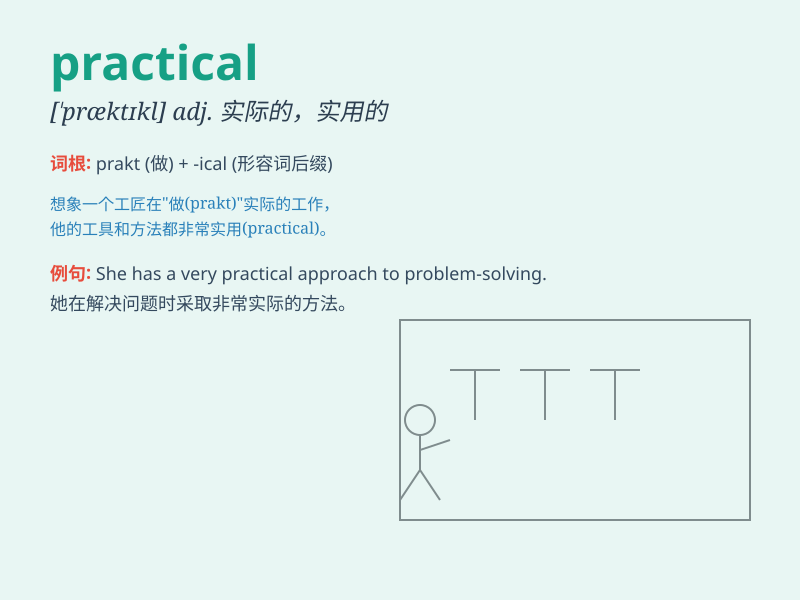

## practical

**英音:** _[\'præktɪk(ə)l]_ **美音:** _[\'præktɪkl]_

**译义:** *adj.实际的,实践的,实用的,应用的,有实际经验的*

### 短语

+ **practical experience:** _实践经验_

+ **practical application:** _实际应用_

+ **practical problem:** _实际问题_

+ **practical skill:** _实用技能_

+ **practical approach:** _实用的方法_

### 例句

#### 例句1

> **The new method is very practical for solving this problem.**

**中文翻译:** 新方法对于解决这个问题非常实用。

**单词释义:** 实用的

#### 例句2

> **She has a practical approach to work.**

**中文翻译:** 她有务实的工作态度。

**单词释义:** 务实的

#### 例句3

> **We need some practical suggestions to improve our sales.**

**中文翻译:** 我们需要一些实用的建议来提高我们的销售。

**单词释义:** 切实可行的

### 背诵小故事

> One day, Tom needed to fix a broken chair. He didn\'t just think
about it but took practical actions. He found tools, measured, and
nailed. His practical skills made the chair good as new.

**有一天，汤姆需要修理一把坏掉的椅子。他没有只是想想而已，而是采取了实际的行动。他找到工具，测量，钉钉。他的实际技能让椅子焕然一新。**

### 图义

