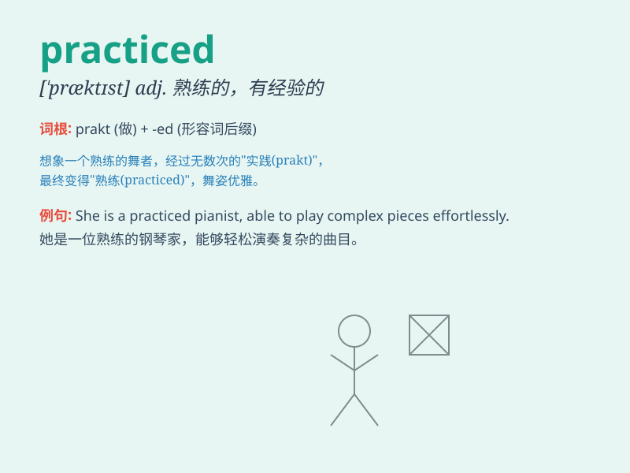

## practiced

**英音:** _[ˈpræktɪst]_ **美音:** _[ˈpræktɪst]_

**译义:** *adj.熟练的,老练的*

### 短语

+ **practiced skill:** _熟练的技能_

+ **practiced routine:** _熟练的常规流程_

+ **practiced method:** _熟练的方法_

+ **be practiced in:** _在\...\...方面熟练_

+ **well-practiced performance:** _训练有素的表现_

### 例句

#### 例句1

> **She is a practiced pianist and can play many difficult
pieces.**

**中文翻译:** 她是一位经验丰富的钢琴家，能演奏许多高难度的曲目。

**单词释义:** 熟练的；有经验的

#### 例句2

> **He practiced speaking English every day to improve his language
skills.**

**中文翻译:** 他每天练习说英语以提高他的语言能力。

**单词释义:** 练习

#### 例句3

> **The doctor has practiced medicine for over 20 years.**

**中文翻译:** 这位医生行医已有20多年。

**单词释义:** 从事（职业）

### 背诵小故事

> One day, a musician practiced playing the piano for hours. He was
very practiced and could play beautifully. His hard work showed that
practice makes perfect.

**有一天，一位音乐家练习弹钢琴好几个小时。他非常熟练，能够弹得很美妙。他的努力表明了熟能生巧。**

### 图义

