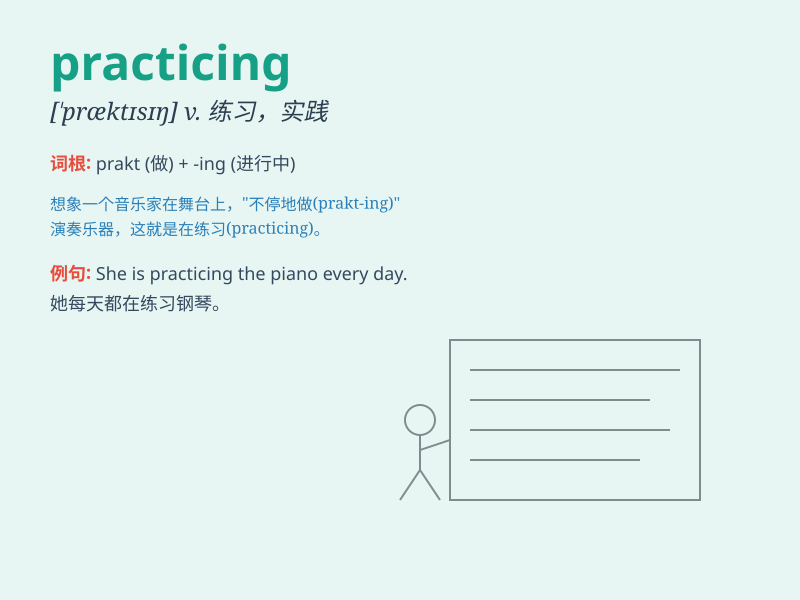

## practicing

**英音:** _[\'præktɪsɪŋ]_ **美音:** _[\'præktɪsɪŋ]_

**译义:** *adj.开业的,在工作的*

### 短语

+ **practicing doctor:** _执业医生_

+ **practicing lawyer:** _执业律师_

+ **practicing skills:** _练习技能_

+ **practicing musician:** _练习中的音乐家_

+ **keep practicing:** _持续练习_

### 例句

#### 例句1

> **She is practicing the piano every day.**

**中文翻译:** 她每天都在练习钢琴。

**单词释义:** 练习

#### 例句2

> **The doctor has been practicing medicine for over 20 years.**

**中文翻译:** 这位医生已行医20多年。

**单词释义:** 从事（职业）

#### 例句3

> **They are practicing speaking English to improve their language
skills.**

**中文翻译:** 他们正在练习说英语以提高他们的语言技能。

**单词释义:** 练习

### 背诵小故事

> One day, Tom was practicing playing the guitar in his room. He was
very focused and kept repeating the chords. His hard practicing paid off
when he could play a beautiful song.

**有一天，汤姆正在他的房间里练习弹吉他。他非常专注，不停地重复和弦。他的努力练习得到了回报，他能够弹奏出一首美妙的歌曲。**

### 图义

