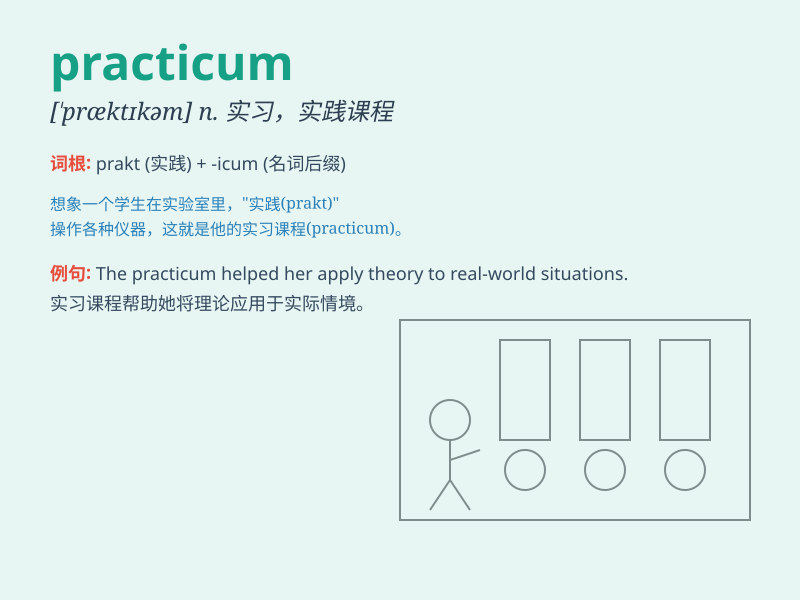

## practicum

**英音:** _[\'præktɪkəm]_ **美音:** _[\'præktəkəm]_

**译义:** *n.实习科目,实习课*

### 短语

+ **clinical practicum:** _临床实习_

+ **teaching practicum:** _教学实习_

+ **engineering practicum:** _工程实习_

+ **internship practicum:** _实习实践_

+ **practical practicum:** _实践课程_

### 例句

#### 例句1

> **The practicum in medicine gave students real clinical
experience.**

**中文翻译:** 医学实习给了学生真实的临床经验。

**单词释义:** 实习课程

#### 例句2

> **She completed her teaching practicum in a local school.**

**中文翻译:** 她在当地一所学校完成了教学实习。

**单词释义:** 实习

#### 例句3

> **The engineering practicum is a crucial part of the
curriculum.**

**中文翻译:** 工程实践是课程的重要组成部分。

**单词释义:** 实习

### 背诵小故事

> A student was nervous about the practicum. But when they started, it
was like a fun adventure. They did practical tasks and learned a lot.
Now they know a practicum is a practical course for learning!

**一名学生对实习课程感到紧张。但当他们开始时，这就像一场有趣的冒险。他们做了实际的任务并学到了很多。现在他们知道
practicum 是一门用于学习的实践课程！**

### 图义

