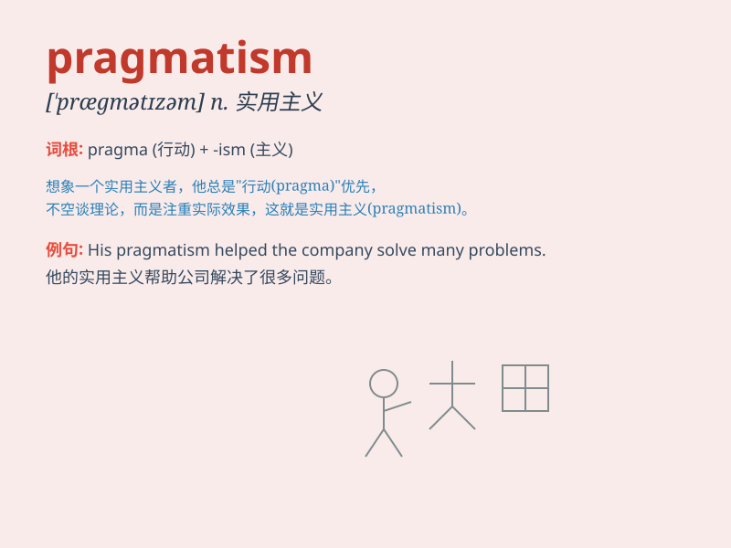

## pragmatism

**英音:** _[\'prægmətɪz(ə)m]_ **美音:**
_[\'prægmə\'tɪzəm]_

**译义:** *n.实用主义*

### 短语

+ **pragmatic approach:** _实用的方法_

+ **pragmatic solution:** _切实可行的解决方案_

+ **pragmatic thinking:** _务实的思维_

+ **pragmatic attitude:** _务实的态度_

+ **pragmatic policy:** _实用的政策_

### 例句

#### 例句1

> **His approach to the problem was guided by pragmatism rather than
idealism.**

**中文翻译:** 他解决问题的方法是实用主义而不是理想主义。

**单词释义:** 实用主义

#### 例句2

> **In business, pragmatism often leads to more successful
outcomes.**

**中文翻译:** 在商业中，实用主义往往会带来更成功的结果。

**单词释义:** 实用主义

#### 例句3

> **She appreciated his pragmatism when it came to making
decisions.**

**中文翻译:** 她欣赏他在做决定时的务实精神。

**单词释义:** 实用主义

### 背诵小故事

> A young entrepreneur faced many challenges. Instead of relying on
theories, he adopted pragmatism. He focused on practical solutions,
tested different methods, and eventually achieved success. His story
shows that pragmatism leads to real results.

**一位年轻的企业家面临许多挑战。他没有依赖理论，而是采用了实用主义。他专注于实际的解决方案，测试不同的方法，最终取得了成功。他的故事表明实用主义会带来实际的成果。**

### 图义

