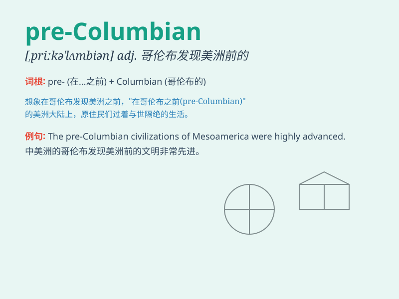

## pre-columbian

**英音:** _[ˌpriː kəˈlʌmbiən]_ **美音:** _[ˌpriː
kəˈlʌmbiən]_

**译义:** *adj. 哥伦布发现新大陆之前的；n.
哥伦布发现新大陆前的美洲人*

### 短语

+ **pre-Columbian art:** _前哥伦布时期的艺术_

+ **pre-Columbian civilization:** _前哥伦布时期的文明_

+ **pre-Columbian architecture:** _前哥伦布时期的建筑_

+ **pre-Columbian culture:** _前哥伦布时期的文化_

+ **pre-Columbian society:** _前哥伦布时期的社会_

### 例句

#### 例句1

> **The pre-Columbian civilizations left behind remarkable
architectural achievements.**

**中文翻译:** 前哥伦布时期的文明留下了非凡的建筑成就。

**单词释义:** 前哥伦布时期的

#### 例句2

> **The museum showcases a collection of pre-Columbian art.**

**中文翻译:** 该博物馆展示了一批前哥伦布时期的艺术品。

**单词释义:** 前哥伦布时期的

#### 例句3

> **The study of pre-Columbian history is fascinating.**

**中文翻译:** 对前哥伦布时期历史的研究很迷人。

**单词释义:** 前哥伦布时期的

### 背诵小故事

>
想象一下，在哥伦布发现新大陆之前，有一群神秘的古人过着独特的生活。他们的文化和传统就是\'pre-columbian\'所代表的，即哥伦布发现美洲大陆以前的。

**想象在哥伦布发现美洲大陆前，存在的那些古人的情况来辅助理解哥伦布发现美洲大陆以前的这个意思**

### 图义

