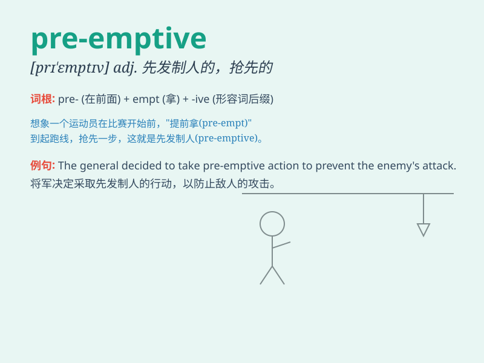

## pre-emptive

**英音:** _[ˌpriːˈemptɪv]_ **美音:** _[ˌpriːˈemptɪv]_

**译义:** *adj. 先发制人的；抢先的*

### 短语

+ **pre-emptive strike:** _先发制人的打击_

+ **pre-emptive action:** _先发制人的行动_

+ **pre-emptive measure:** _预防措施；先发制人的措施_

+ **pre-emptive bid:** _先叫牌_

+ **pre-emptive right:** _优先购买权_

### 例句

#### 例句1

> **The company took a pre-emptive strike to prevent its rivals from
entering the market.**

**中文翻译:**
这家公司采取了先发制人的打击，以防止其竞争对手进入市场。

**单词释义:** 先发制人的

#### 例句2

> **The government\'s pre-emptive measures helped to avoid a major
crisis.**

**中文翻译:** 政府的预防性措施有助于避免一场重大危机。

**单词释义:** 预防性的

#### 例句3

> **She made a pre-emptive move to secure the best position in the
project.**

**中文翻译:** 她抢先行动以确保在该项目中获得最佳位置。

**单词释义:** 抢先的

### 背诵小故事

> A king was worried about enemy attacks. So, he took pre-emptive
actions and sent his army to strike first. This helped him protect his
kingdom. Pre-emptive means taking action before others to prevent
problems.

**一位国王担心敌人的攻击。于是，他采取了先发制人的行动，派遣他的军队率先出击。这帮助他保护了自己的王国。pre-emptive
意思是先于他人采取行动以预防问题。**

### 图义

