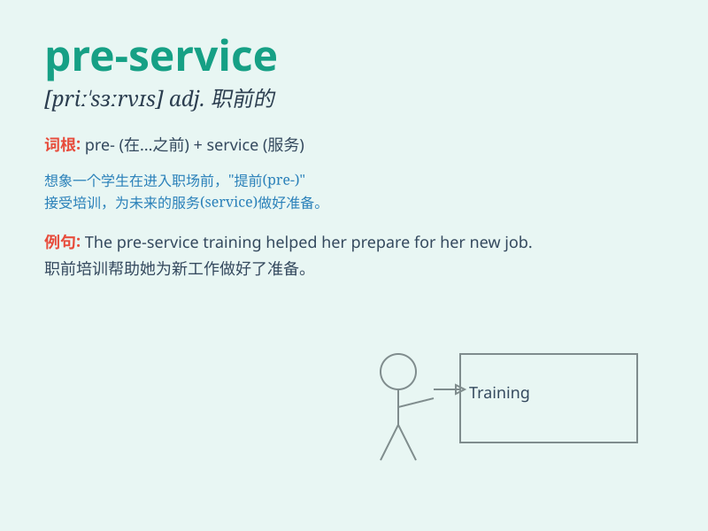

## pre-service

**英音:** _[priːˈsɜːrvɪs]_ **美音:** _[priːˈsɜːrvɪs]_

**译义:** *n. 服务前，服务前的准备；服务前的培训*

### 短语

+ **pre-service training:** _职前培训_

+ **pre-service education:** _职前教育_

+ **pre-service teacher:** _职前教师_

+ **pre-service course:** _职前课程_

+ **pre-service preparation:** _职前准备_

### 例句

#### 例句1

> **The pre-service training for teachers is very important.**

**中文翻译:** 教师的职前培训非常重要。

**单词释义:** 职前的

#### 例句2

> **We need to improve the pre-service education of nurses.**

**中文翻译:** 我们需要改进护士的职前教育。

**单词释义:** 职前的

#### 例句3

> **The pre-service inspection of the machine is necessary.**

**中文翻译:** 这台机器的售前检查是必要的。

**单词释义:** 售前的

### 背诵小故事

> 想象一位年轻人，在正式工作前参加了很多培训。他处于 pre-service
阶段，就像站在工作大门前的准备期，充满期待又努力学习，为即将到来的工作服务做好充分准备。

**（指就业前的）职前培训；岗前的**

### 图义

