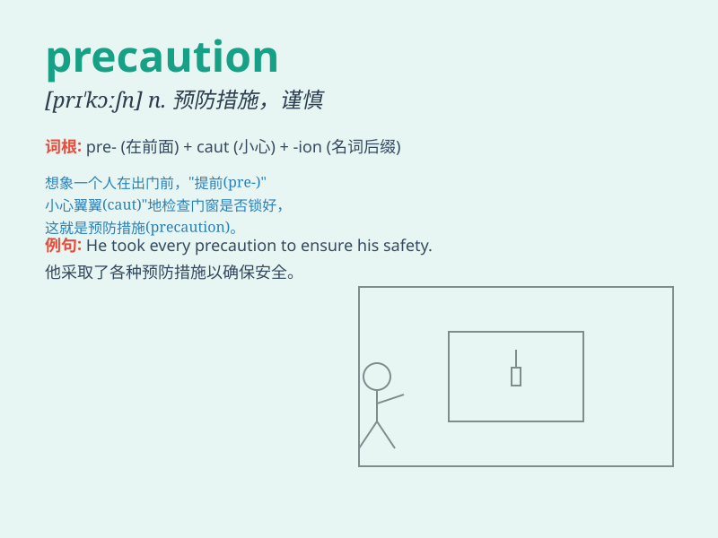

## precaution

**英音:** _[prɪ\'kɔːʃ(ə)n]_ **美音:** _[prɪ\'kɔʃən]_

**译义:** *n.预防,警惕,防范*

### 短语

+ **take precautions:** _采取预防措施_

+ **precaution against:** _预防；防备_

+ **safety precaution:** _安全预防措施_

+ **fire precaution:** _防火措施_

+ **necessary precaution:** _必要的预防措施_

### 例句

#### 例句1

> **We need to take precautions against the spread of the virus.**

**中文翻译:** 我们需要采取预防措施来防止病毒的传播。

**单词释义:** 预防措施

#### 例句2

> **The company has implemented several precautions to ensure worker
safety.**

**中文翻译:** 该公司已采取多项预防措施来确保工人的安全。

**单词释义:** 预防措施

#### 例句3

> **He always drives with precaution, especially in bad weather.**

**中文翻译:** 他总是谨慎驾驶，尤其是在恶劣天气下。

**单词释义:** 谨慎

### 背诵小故事

> A brave explorer was about to enter a dangerous cave. Before going
in, he took many precautions, like checking his equipment and studying
the cave map. These careful actions helped him avoid potential dangers.
Remember, \'precaution\' means a careful action taken in advance to
prevent something bad.

**一位勇敢的探险家即将进入一个危险的洞穴。在进去之前，他采取了很多预防措施，比如检查装备和研究洞穴地图。这些谨慎的行动帮助他避免了潜在的危险。记住，\'precaution\'意思是为预防不好的事情而提前采取的谨慎行动。**

### 图义

