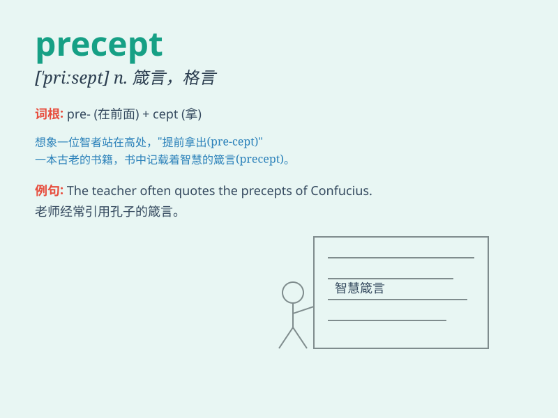

## precept

**英音:** _[\'priːsept]_ **美音:** _[\'prisɛpt]_

**译义:** *n.规则*

### 短语

+ **moral precept:** _道德规范_

+ **religious precept:** _宗教戒律_

+ **precept and example:** _规诫与榜样_

+ **follow the precept:** _遵循规范_

+ **violate the precept:** _违反戒律_

### 例句

#### 例句1

> **The precept \'Honesty is the best policy\' is widely known.**

**中文翻译:** "诚实是上策"这一格​​言广为人知。

**单词释义:** 箴言；戒律

#### 例句2

> **He always follows the precepts of his religion strictly.**

**中文翻译:** 他始终严格遵守宗教戒律。

**单词释义:** 戒律；规范

#### 例句3

> **The teacher gave us a precept on how to study effectively.**

**中文翻译:** 老师给了我们如何有效学习的戒律。

**单词释义:** 训诫；教导

### 背诵小故事

> A wise old owl gave a precept to the little birds: \'Always be kind
and share.\' The little birds remembered this rule and lived happily.
So, precept means a rule or principle that guides behavior.

**一只聪明的老猫头鹰给小鸟们一条训诫：'永远要善良和分享。'小鸟们记住了这条规则，快乐地生活着。所以，precept
意思是指导行为的规则或原则。**

### 图义

