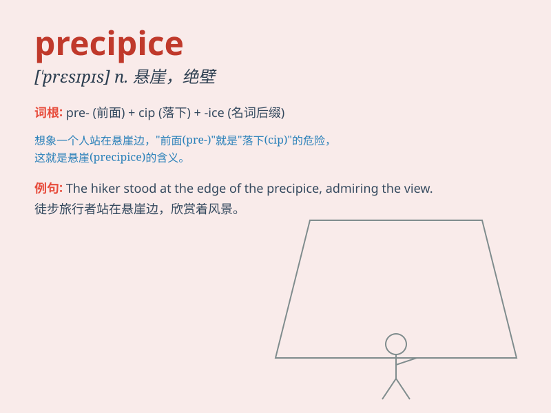

## precipice

**英音:** _[\'presɪpɪs]_ **美音:** _[\'prɛsəpɪs]_

**译义:** *n.悬崖*

### 短语

+ **on the precipice:** _处于悬崖边缘；处于危急关头_

+ **precipice edge:** _悬崖边缘_

+ **steep precipice:** _陡峭的悬崖_

+ **over the precipice:** _越过悬崖；处于绝境_

+ **precipice of disaster:** _灾难的边缘_

### 例句

#### 例句1

> **He was standing on the precipice, looking down at the deep valley
below.**

**中文翻译:** 他站在悬崖上，俯视着下面的深谷。

**单词释义:** 悬崖；绝壁

#### 例句2

> **The company is on the precipice of bankruptcy.**

**中文翻译:** 该公司正处于破产边缘。

**单词释义:** 险境；危急关头

#### 例句3

> **She felt as if her life was at a precipice and she had to make a
crucial decision.**

**中文翻译:**
她感觉自己的人生已经走到了悬崖边，她必须做出一个至关重要的决定。

**单词释义:** （危险的）边缘

### 背诵小故事

> A brave adventurer was climbing a mountain. As he reached the edge,
he saw a terrifying precipice. One wrong step and he would fall. It made
him realize the danger and be cautious.

**一位勇敢的冒险家正在爬山。当他到达边缘时，看到了一个可怕的悬崖。只要走错一步，他就会掉下去。这让他意识到了危险并变得谨慎。**

### 图义

