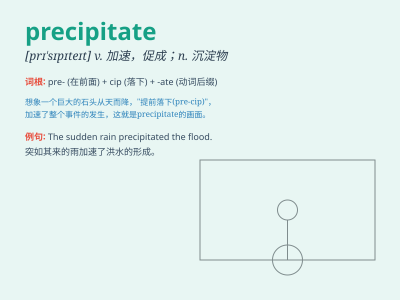

## precipitate

**英音:** _[prɪ\'sɪpɪteɪt]_ **美音:** _[prɪ\'sɪpɪtet]_

**译义:**
*n.沉淀物vt.猛抛,使陷入,促成,使沉淀vi.猛地落下adj.突如其来的,陡然下降(或下落)的,贸然轻率的*

### 短语

+ **precipitate action:** _仓促的行动_

+ **precipitate decision:** _草率的决定_

+ **precipitate event:** _突如其来的事件_

+ **precipitate oneself into:** _匆忙投入_

+ **precipitate a crisis:** _引发危机_

### 例句

#### 例句1

> **The bad news precipitated a crisis in the company.**

**中文翻译:** 这个坏消息引发了公司的危机。

**单词释义:** 引发；促使

#### 例句2

> **The chemical reaction will precipitate a solid from the
solution.**

**中文翻译:** 化学反应将从溶液中沉淀出固体。

**单词释义:** 使沉淀；使析出

#### 例句3

> **His hasty decision precipitated the project\'s failure.**

**中文翻译:** 他的仓促决定导致了该项目的失败。

**单词释义:** 使突然发生；加速

### 背诵小故事

> A brave scientist was conducting an experiment. A sudden mistake
precipitated a dangerous reaction. But he remained calm and managed to
control the situation. \'Precipitate\' here means cause something to
happen suddenly and unexpectedly.

**一位勇敢的科学家正在做实验。一个突然的错误引发了危险的反应。但他保持冷静并设法控制住了局面。\'precipitate\'在这里指突然意外地导致某事发生。**

### 图义

