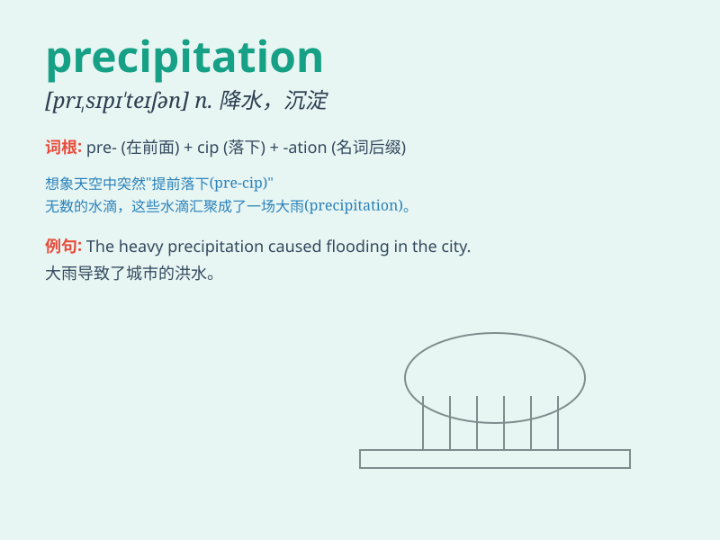

## precipitation

**英音:** _[prɪ,sɪpɪ\'teɪʃ(ə)n]_ **美音:**
_[prɪ\'sɪpə\'teʃən]_

**译义:** *n.仓促*

### 短语

+ **atmospheric precipitation:** _大气降水_

+ **precipitation intensity:** _降水强度_

+ **precipitation type:** _降水类型_

+ **annual precipitation:** _年降水量_

+ **precipitation measurement:** _降水量测量_

### 例句

#### 例句1

> **The precipitation in this area is very heavy during the rainy
season.**

**中文翻译:** 该地区雨季期间降水量很大。

**单词释义:** 降水

#### 例句2

> **We need to study the pattern of precipitation to manage water
resources effectively.**

**中文翻译:** 我们需要研究降水模式以有效管理水资源。

**单词释义:** 降水

#### 例句3

> **The lack of precipitation has caused a drought in the region.**

**中文翻译:** 降水不足导致该地区出现干旱。

**单词释义:** 降水

### 背诵小故事

>
想象一下，天空中乌云密布，突然大量的雨滴和雪花快速落下，就像有人急匆匆地往下扔东西。这急匆匆落下的雨和雪就是\'precipitation\'（降水、降雨量）。

**想象天空中乌云导致大量雨滴和雪花快速落下的情景来辅助记忆\'precipitation\'这个表示降水、降雨量的单词。**

### 图义

