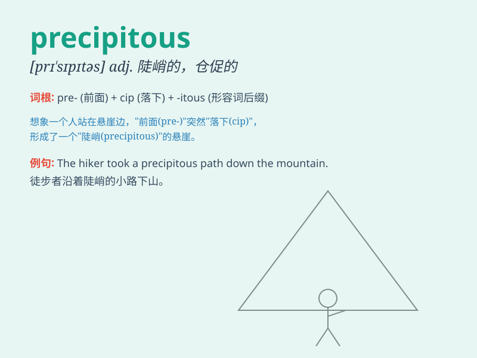

## precipitous

**英音:** _[prɪ\'sɪpɪtəs]_ **美音:** _[prɪ\'sɪpɪtəs]_

**译义:** *adj.陡峭的,急躁的*

### 短语

+ **precipitous cliff:** _陡峭的悬崖_

+ **precipitous decline:** _急剧下降_

+ **precipitous path:** _险峻的小路_

+ **precipitous rise:** _急剧上升_

+ **precipitous slope:** _陡峭的斜坡_

### 例句

#### 例句1

> **The path up the mountain was precipitous and dangerous.**

**中文翻译:** 上山的路崎岖险峻。

**单词释义:** 陡峭的

#### 例句2

> **The company\'s financial decline was precipitous in the last
quarter.**

**中文翻译:** 该公司上季度的财务状况急剧下滑。

**单词释义:** 急剧的

#### 例句3

> **She made a precipitous decision to quit her job without a backup
plan.**

**中文翻译:** 她在没有后备计划的情况下仓促决定辞职。

**单词释义:** 贸然的；轻率的

### 背诵小故事

> A brave climber was on a precipitous mountain path. One wrong step
and he could fall. The path was very steep and dangerous, just like the
meaning of \'precipitous\'.

**一位勇敢的登山者走在一条陡峭的山路上。一步走错，他就可能坠落。这条路非常险峻，就像'precipitous'这个词所表达的那样。**

### 图义

