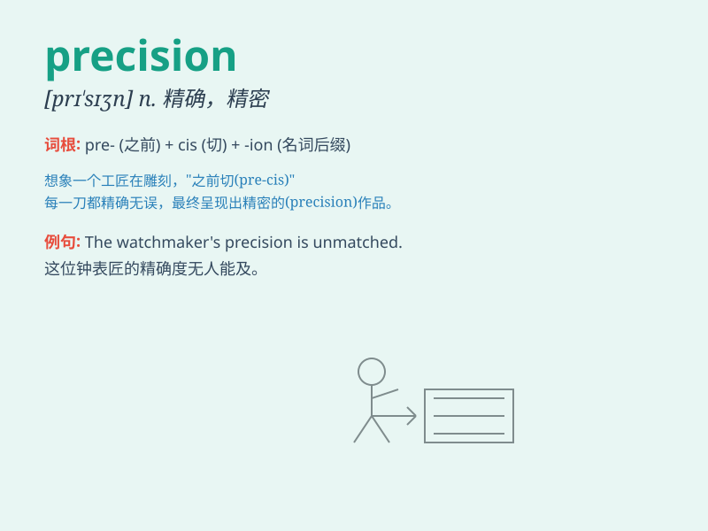

## precision

**英音:** _[prɪ\'sɪʒ(ə)n]_ **美音:** _[prɪ\'sɪʒn]_

**译义:** *n.精确,精密度,精度*

### 短语

+ **precision engineering:** _精密工程_

+ **precision instrument:** _精密仪器_

+ **precision manufacturing:** _精密制造_

+ **high precision:** _高精度_

+ **precision measurement:** _精密测量_

### 例句

#### 例句1

> **The engineer demanded a high level of precision in the
manufacturing process.**

**中文翻译:** 工程师对制造过程的精度要求很高。

**单词释义:** 精度；精确

#### 例句2

> **Her movements had a remarkable precision.**

**中文翻译:** 她的动作异常精准。

**单词释义:** 精确；准确

#### 例句3

> **The watch is known for its precision timing.**

**中文翻译:** 该腕表以其精准计时而闻名。

**单词释义:** 精确；精准

### 背诵小故事

> A scientist was conducting an experiment and needed extreme
PRECISION. Every measurement, every calculation had to be perfect.
Without it, the entire project would fail. He focused intently to
achieve this PRECISION.

**一位科学家正在进行一项实验，需要极高的精准度。每一次测量，每一次计算都必须完美。没有它，整个项目就会失败。他全神贯注以达到这种精准。**

### 图义

