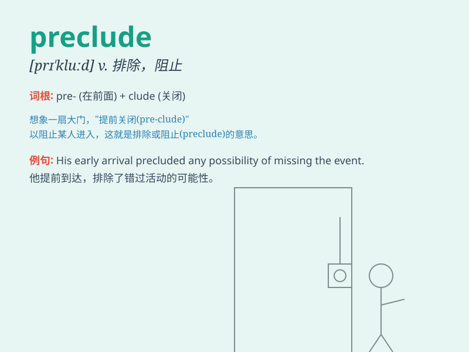

## preclude

**英音:** _[prɪ\'kluːd]_ **美音:** _[prɪ\'klud]_

**译义:** *n.排除*

### 短语

+ **preclude from:** _阻止；妨碍；使不可能_

+ **preclude the possibility:** _排除可能性_

+ **preclude any doubt:** _消除任何疑虑_

+ **preclude an error:** _防止错误_

+ **preclude misunderstanding:** _避免误解_

### 例句

#### 例句1

> **His injury precluded him from playing in the final game.**

**中文翻译:** 他的受伤使他无法参加最后一场比赛。

**单词释义:** 阻止；妨碍

#### 例句2

> **The bad weather precluded our going for a picnic.**

**中文翻译:** 恶劣的天气使我们无法去野餐。

**单词释义:** 排除；杜绝

#### 例句3

> **Lack of funds precluded the project from going ahead.**

**中文翻译:** 由于缺乏资金，该项目无法继续进行。

**单词释义:** 使不可能；阻止

### 背诵小故事

>
想象一下，你正在准备一场重要的考试，但是你忘记带笔了，这就预先排除（preclude）了你顺利答题的可能性。没有笔，你无法正常考试，就像某些条件会预先阻止一件事情的发生。

**想象准备考试忘带笔预先排除顺利答题的可能，来说明preclude（阻止；排除；妨碍）的意思**

### 图义

