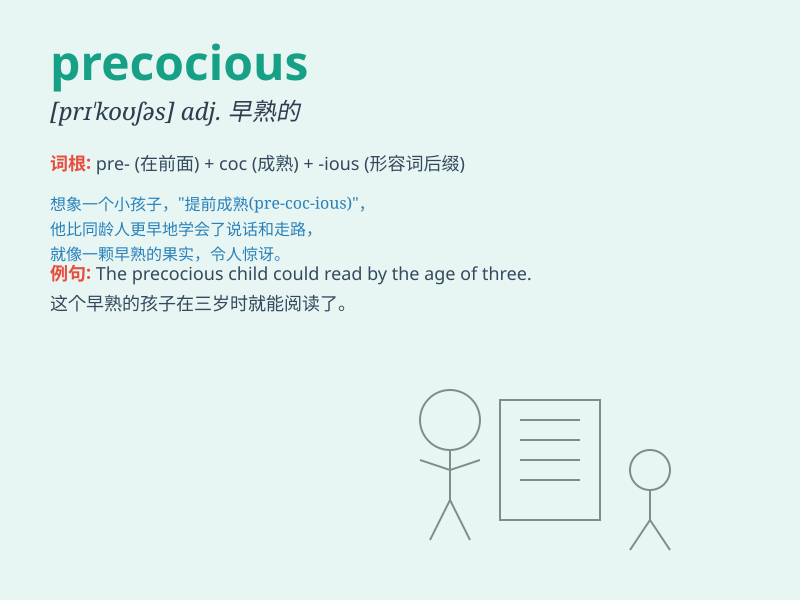

## precocious

**英音:** _[prɪ\'kəʊʃəs]_ **美音:** _[prɪ\'koʃəs]_

**译义:** *adj.早熟的*

### 短语

+ **precocious child:** _早熟的孩子_

+ **precocious talent:** _早熟的才能_

+ **precocious development:** _过早的发展_

+ **precocious puberty:** _性早熟_

+ **precocious intelligence:** _超常的智力_

### 例句

#### 例句1

> **The precocious child could read and write at the age of
three.**

**中文翻译:** 早熟的孩子三岁就能读书写字。

**单词释义:** 早熟的

#### 例句2

> **She showed a precocious talent for music.**

**中文翻译:** 她表现出了早熟的音乐天赋。

**单词释义:** 早熟的；天赋高的

#### 例句3

> **His precocious behavior often surprises adults.**

**中文翻译:** 他早熟的行为常常让成年人感到惊讶。

**单词释义:** 早熟的

### 背诵小故事

> A little girl named Lily was very precocious. She could solve complex
math problems at a young age and had a deep understanding of art. Her
precocious talents amazed everyone around her.

**有个叫莉莉的小女孩非常早熟。她年纪很小就能解决复杂的数学问题，对艺术也有很深的理解。她早熟的天赋让周围的人都感到惊讶。**

### 图义

