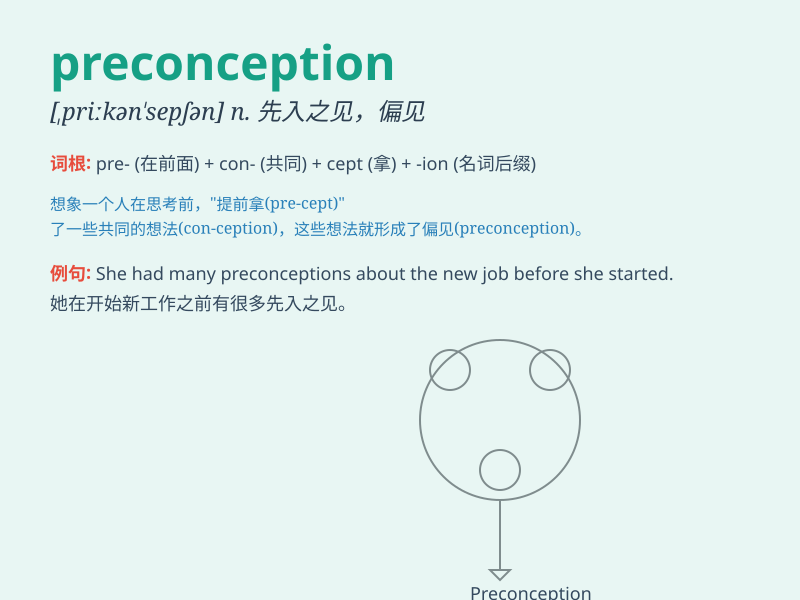

## preconception

**英音:** _[priːkən\'sepʃ(ə)n]_ **美音:**
_[,prikən\'sɛpʃən]_

**译义:** *n.预想,偏见*

### 短语

+ **have a preconception:** _有先入之见_

+ **overcome preconception:** _克服先入之见_

+ **be influenced by preconception:** _受先入之见的影响_

+ **challenge preconception:** _挑战先入之见_

+ **break down preconception:** _打破先入之见_

### 例句

#### 例句1

> **She had a preconception that all lawyers were dishonest.**

**中文翻译:** 她有一种先入为主的观念，认为所有律师都是不诚实的。

**单词释义:** 先入为主的看法；成见

#### 例句2

> **His preconception about the difficulty of the exam was
unfounded.**

**中文翻译:** 他对考试难度的先入之见是没有根据的。

**单词释义:** 成见；偏见

#### 例句3

> **We need to overcome our preconceptions and approach the problem
with an open mind.**

**中文翻译:** 我们需要克服先入为主的观念，以开放的心态处理问题。

**单词释义:** 先入之见；预想

### 背诵小故事

> A young scientist had a preconception that all experiments would
fail. But one day, a surprising result proved her wrong. It taught her
to let go of preconceived ideas and explore with an open mind.

**一位年轻的科学家原本有先入为主的观念，认为所有实验都会失败。但有一天，一个令人惊讶的结果证明她错了。这教会她放下先入之见，以开放的心态去探索。**

### 图义

