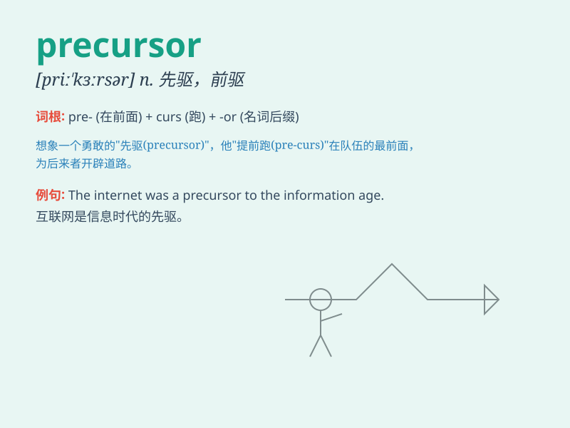

## precursor

**英音:** _[prɪ\'kɜːsə]_ **美音:** _[pri\'kɝsɚ]_

**译义:** *n.先驱*

### 短语

+ **precursor protein:** _前体蛋白_

+ **chemical precursor:** _化学前体_

+ **precursor event:** _先导事件_

+ **precursor molecule:** _前体分子_

+ **precursor compound:** _前体化合物_

### 例句

#### 例句1

> **The new drug is a precursor of a more effective treatment.**

**中文翻译:** 这种新药是一种更有效治疗方法的先驱。

**单词释义:** 前身；先驱

#### 例句2

> **Radar was a precursor to modern navigation systems.**

**中文翻译:** 雷达是现代导航系统的先驱。

**单词释义:** 先驱；先导

#### 例句3

> **The increased rainfall was a precursor of the flood.**

**中文翻译:** 降雨量的增加是洪水的前兆。

**单词释义:** 先兆；预兆

### 背诵小故事

>
想象一位勇敢的探险家，每次出发前都会仔细研究前人留下的地图和笔记，这些前人的成果就是他探险之旅的
precursor 。就好像是先头部队，为他指明了方向。

**想象一位勇敢的探险家，每次出发前都会仔细研究前人留下的地图和笔记，这些前人的成果就是他探险之旅的先驱、前身。就好像是先头部队，为他指明了方向。**

### 图义

