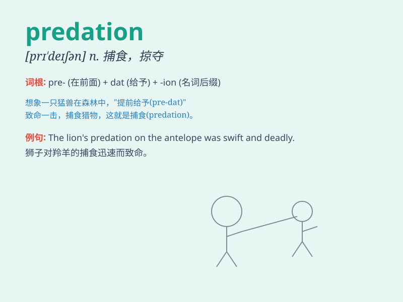

## predation

**英音:** _[preɪˈdeɪʃn]_ **美音:** _[preɪˈdeɪʃn]_

**译义:** *n.捕食；掠夺；侵蚀*

### 短语

+ **predation pressure:** _捕食压力_

+ **predation risk:** _捕食风险_

+ **predation behavior:** _捕食行为_

+ **predation strategy:** _捕食策略_

+ **predation cycle:** _捕食周期_

### 例句

#### 例句1

> **The predation of lions on zebras is a common sight in the African
savannah.**

**中文翻译:** 狮子对斑马的捕食在非洲大草原是常见的景象。

**单词释义:** 捕食

#### 例句2

> **Predation by birds can have a significant impact on insect
populations.**

**中文翻译:** 鸟类的捕食会对昆虫的数量产生重大影响。

**单词释义:** 捕食

#### 例句3

> **The introduction of a new predator led to increased predation on
the native species.**

**中文翻译:** 引入一种新的捕食者导致了对本地物种捕食的增加。

**单词释义:** 捕食

### 背诵小故事

> A brave lion was on a hunt for food. Its act of chasing and catching
other animals for survival was called predation. The lion needed this to
stay alive and keep its pride strong.

**一只勇敢的狮子正在寻找食物。它追逐并捕获其他动物以求生存的行为被称为捕食。狮子需要这样做来维持生命并保持其族群的强大。**

### 图义

