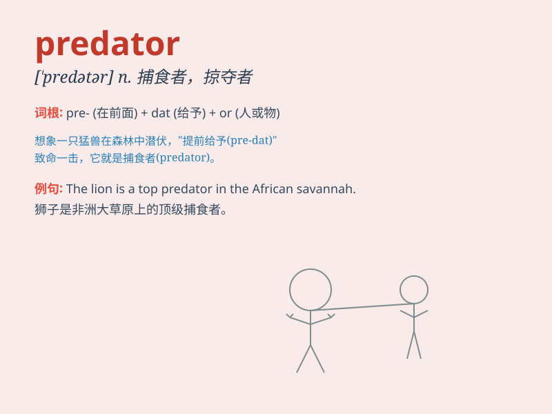

## predator

**英音:** _[\'predətə]_ **美音:**
_[ˈpredətər;predˈətər]_

**译义:** *n.掠夺者,食肉动物*

### 短语

+ **top predator:** _顶级掠食者_

+ **predator-prey relationship:** _捕食者与猎物的关系_

+ **marine predator:** _海洋掠食者_

+ **terrestrial predator:** _陆地掠食者_

+ **predator species:** _掠食者物种_

### 例句

#### 例句1

> **The lion is a powerful predator in the wild.**

**中文翻译:** 狮子是野外强大的掠食者。

**单词释义:** 捕食者

#### 例句2

> **The company has to be vigilant against business predators.**

**中文翻译:** 公司必须警惕商业掠夺者。

**单词释义:** 掠夺者

#### 例句3

> **Sharks are known as predators of the ocean.**

**中文翻译:** 鲨鱼被称为海洋掠食者。

**单词释义:** 捕食者

### 背诵小故事

> In the deep forest, a fierce lion was lurking. It was a predator,
always on the hunt for its next meal. One day, it quietly stalked a
deer, ready to pounce. The lion was the master of the hunt, a true
predator.

**在幽深的森林里，一只凶猛的狮子潜伏着。它是一个捕食者，总是在寻觅下一顿美餐。有一天，它悄悄地跟踪一只鹿，准备猛扑过去。这头狮子是狩猎的高手，一个真正的捕食者。**

### 图义

