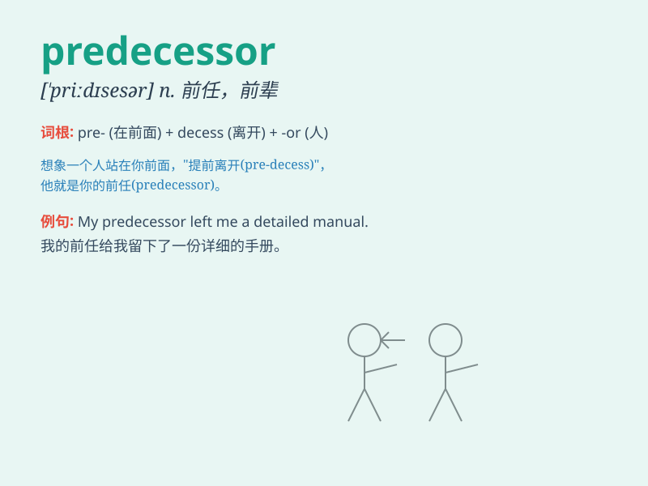

## predecessor

**英音:** _[\'priːdɪsesə]_ **美音:** _[\'prɛdəsɛsɚ]_

**译义:** *n.前辈,前任,(被取代的)原有事物*

### 短语

+ **immediate predecessor:** _直接前任；紧邻的前一事物_

+ **predecessor company:** _前公司_

+ **predecessor state:** _前政权；先前的国家_

+ **predecessor event:** _前一事件_

+ **predecessor model:** _前一代模型_

### 例句

#### 例句1

> **My predecessor in this job was much more experienced.**

**中文翻译:** 我从事这项工作的前任经验丰富得多。

**单词释义:** 前任

#### 例句2

> **The new model is a vast improvement over its predecessor.**

**中文翻译:** 新模型比其前身有了巨大的改进。

**单词释义:** 前身；原先的东西

#### 例句3

> **The company\'s financial situation is much better than that of
its predecessor.**

**中文翻译:** 该公司的财务状况比其前身要好得多。

**单词释义:** 前任（时期）

### 背诵小故事

>
想象一个古老的王国，国王退位了。新国王上任，而之前的那位国王就是新国王的
predecessor（前任）。他留下了许多经验和教训，新国王从他的作为中学习和借鉴。

**想象一个古老王国中，新国王的前任国王留下经验和教训，帮助理解
predecessor 这个词意为前任、前辈**

### 图义

