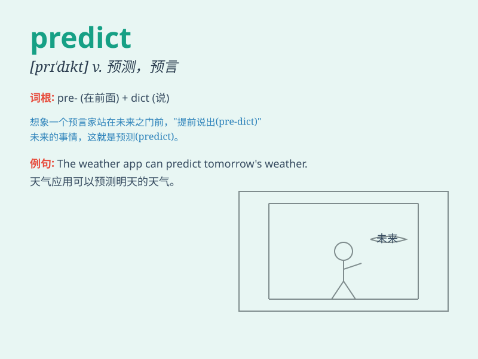

## predict

**英音:** _[prɪ\'dɪkt]_ **美音:** _[prɪ\'dɪkt]_

**译义:** *v.预知,预言,预报*

### 短语

+ **predict the future:** _预测未来_

+ **predict accurately:** _准确预测_

+ **predict disaster:** _预测灾难_

+ **difficult to predict:** _难以预测_

+ **predict outcome:** _预测结果_

### 例句

#### 例句1

> **The weather forecast predicts rain for tomorrow.**

**中文翻译:** 天气预报预计明天有雨。

**单词释义:** 预测；预报

#### 例句2

> **It\'s difficult to predict which team will win the
championship.**

**中文翻译:** 很难预测哪支球队会赢得冠军。

**单词释义:** 预测；预料

#### 例句3

> **She accurately predicted the outcome of the election.**

**中文翻译:** 她准确地预测了选举结果。

**单词释义:** 预言；预告

### 背诵小故事

> A fortune teller claims to predict the future. One day, a young man
visited. The teller predicted he would meet his true love soon. But in
the end, it was just a guess. Remember, predict means to say what will
happen before it occurs.

**一位算命师声称能预测未来。有一天，一个年轻人前来。算命师预测他很快会遇到真爱。但最后，这只是猜测。记住，predict
意思是在事情发生之前说出将会发生什么。**

### 图义

