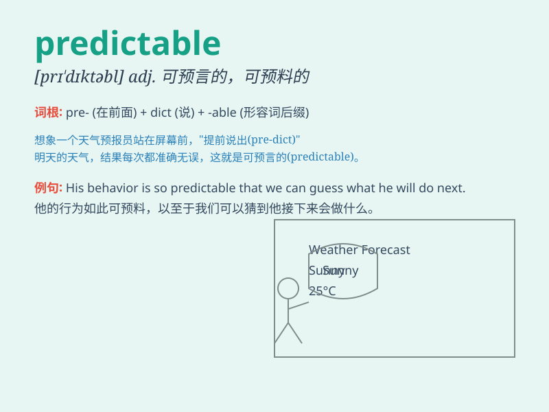

## predictable

**英音:** _[prɪ\'dɪktəb(ə)l]_ **美音:** _[prɪ\'dɪktəbl]_

**译义:** *adj.可预言的*

### 短语

+ **predictable outcome:** _可预测的结果_

+ **predictable pattern:** _可预测的模式_

+ **predictable behavior:** _可预测的行为_

+ **predictable reaction:** _可预测的反应_

+ **predictable schedule:** _可预测的日程安排_

### 例句

#### 例句1

> **The plot of this movie is so predictable that I guessed the
ending within the first half hour.**

**中文翻译:** 这部电影的剧情太有预见性了，前半个小时我就猜到了结局。

**单词释义:** 可预测的；意料之中的

#### 例句2

> **His behavior is quite predictable; he always reacts the same way
in such situations.**

**中文翻译:**
他的行为是可以预见的。在这种情况下他总是做出同样的反应。

**单词释义:** 可预见的；不出所料的

#### 例句3

> **The weather in this region during this time of year is usually
predictable.**

**中文翻译:** 一年中这个时候该地区的天气通常是可以预测的。

**单词释义:** 可预测的；可预料的

### 背诵小故事

> A magician always performed the same tricks, making his shows
completely predictable. People could guess exactly what would happen
next. It was so boring! The word \'predictable\' means able to be
predicted or expected.

**一位魔术师总是表演同样的把戏，使得他的表演完全可预测。人们能准确猜到接下来会发生什么。太无聊了！单词\'predictable\'意思是可预测的；可预料的。**

### 图义

