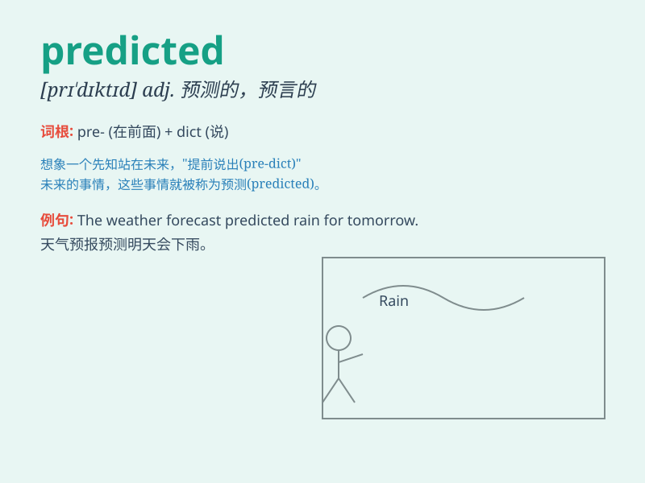

## predicted

**英音:** _[prɪˈdɪktɪd]_ **美音:** _[prɪˈdɪktɪd]_

**译义:** *v. 预言；预报；预知（predict 的过去分词）*

### 短语

+ **predicted value:** _预测值_

+ **predicted outcome:** _预测结果_

+ **predicted trend:** _预测趋势_

+ **predicted effect:** _预测效果_

+ **predicted response:** _预测反应_

### 例句

#### 例句1

> **The weatherman predicted rain for tomorrow.**

**中文翻译:** 气象员预测明天有雨。

**单词释义:** 预测；预言

#### 例句2

> **She predicted that the economy would improve.**

**中文翻译:** 她预言经济将会改善。

**单词释义:** 预言；预料

#### 例句3

> **No one could have predicted such a strange outcome.**

**中文翻译:** 没有人能预料到这样奇怪的结果。

**单词释义:** 预料；预见

### 背诵小故事

> A scientist carefully studied the data and predicted that there would
be a solar eclipse. People were amazed when his prediction came true. It
showed how powerful his knowledge and analysis were.

**一位科学家仔细研究了数据并预测将会有日食。当他的预测成真时，人们都感到惊讶。这显示出他的知识和分析是多么强大。**

### 图义

