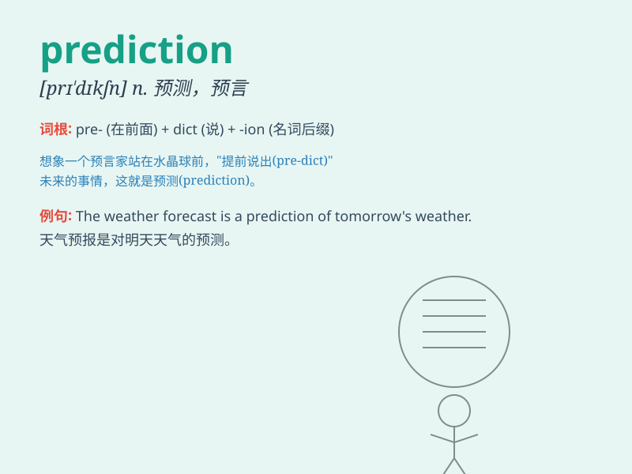

## prediction

**英音:** _[prɪ\'dɪkʃ(ə)n]_ **美音:** _[prɪ\'dɪkʃən]_

**译义:** *n.预言,预报*

### 短语

+ **weather prediction:** _天气预报_

+ **accurate prediction:** _准确的预测_

+ **economic prediction:** _经济预测_

+ **long-term prediction:** _长期预测_

+ **prediction error:** _预测误差_

### 例句

#### 例句1

> **The weather prediction said it would rain tomorrow.**

**中文翻译:** 天气预报说明天会下雨。

**单词释义:** 预测；预报

#### 例句2

> **Her prediction about the outcome of the game was accurate.**

**中文翻译:** 她对比赛结果的预测是准确的。

**单词释义:** 预测；预言

#### 例句3

> **Despite his optimistic prediction, the project failed.**

**中文翻译:** 尽管他的预测很乐观，但该项目还是失败了。

**单词释义:** 预测；推测

### 背诵小故事

> One day, a scientist made a prediction that there would be a big
storm. Everyone was worried. But his prediction came true and they were
prepared. So, prediction means saying what will happen in the future.

**有一天，一位科学家做出了将会有一场大风暴的预测。每个人都很担心。但他的预测成真了，而且他们有所准备。所以，prediction
意思是对未来将会发生什么的预言。**

### 图义

