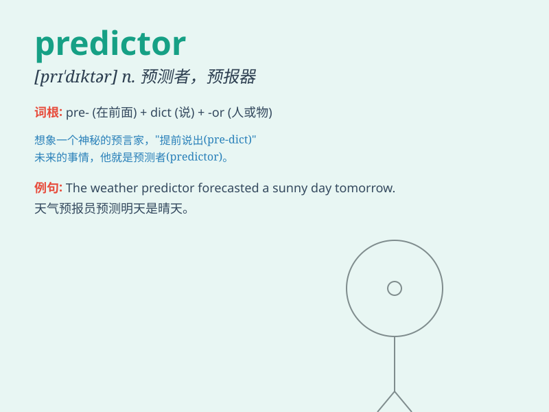

## predictor

**英音:** _[prɪˈdɪktə(r)]_ **美音:** _[prɪˈdɪktər]_

**译义:** *n.预言者,预报器*

### 短语

+ **linear predictor:** _线性预测器_

+ **weather predictor:** _天气预报员_

+ **economic predictor:** _经济预测者_

+ **market predictor:** _市场预测者_

+ **accurate predictor:** _准确的预测者_

### 例句

#### 例句1

> **The weather predictor said it would rain tomorrow.**

**中文翻译:** 天气预报说明天会下雨。

**单词释义:** 预测者；预言家

#### 例句2

> **Stock market predictors often make inaccurate forecasts.**

**中文翻译:** 股市预测者经常做出不准确的预测。

**单词释义:** 预测者；预报者

#### 例句3

> **He is considered a reliable predictor of election results.**

**中文翻译:** 他被认为是选举结果的可靠预测者。

**单词释义:** 预测者；预报员

### 背诵小故事

> A predictor is like a smart detective. Imagine a scientist who
studies the weather. By looking at clouds and wind patterns, he can
predict if it will rain. This scientist is a predictor. He uses clues to
tell what will happen next.

**预测器就像一个聪明的侦探。想象一位研究天气的科学家，通过观察云和风的模式，他能预测是否会下雨。这位科学家就是一个预测器。他利用线索来告知接下来会发生什么。**

### 图义

