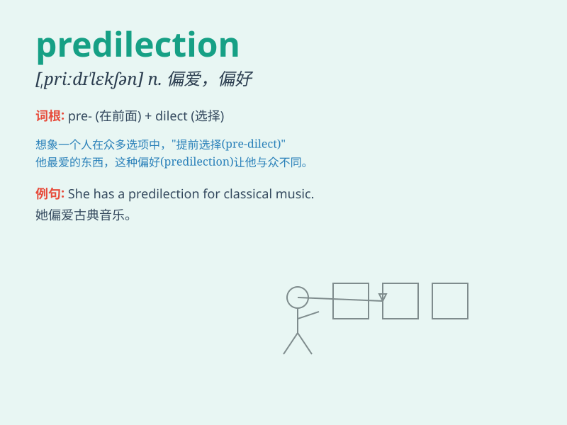

## predilection

**英音:** _[ˌpriːdɪˈlekʃn]_ **美音:** _[ˌpredlˈekʃn]_

**译义:** *n.爱好,偏袒*

### 短语

+ **have a predilection for:** _偏爱；喜好_

+ **show predilection:** _表现出偏爱_

+ **predilection towards:** _对\...\...的偏爱_

+ **strong predilection:** _强烈的偏爱_

+ **personal predilection:** _个人偏好_

### 例句

#### 例句1

> **She has a predilection for chocolate cake.**

**中文翻译:** 她偏爱巧克力蛋糕。

**单词释义:** 特别喜爱，偏爱

#### 例句2

> **His predilection for adventure led him to explore remote
places.**

**中文翻译:** 他对冒险的热爱促使他去探索偏远的地方。

**单词释义:** 偏爱，喜好

#### 例句3

> **The artist\'s predilection for bright colors was evident in all
of her paintings.**

**中文翻译:** 这位艺术家对明亮色彩的偏爱在她的所有画作中都很明显。

**单词释义:** 偏好，倾向

### 背诵小故事

> A prince had a predilection for collecting rare jewels. One day, he
found a unique gem that made his collection even more special. His love
for these jewels showed his clear preference.

**一位王子有偏爱收集稀有珠宝的喜好。有一天，他发现了一颗独特的宝石，使他的收藏更加特别。他对这些珠宝的喜爱显示了他明显的偏爱。**

### 图义

