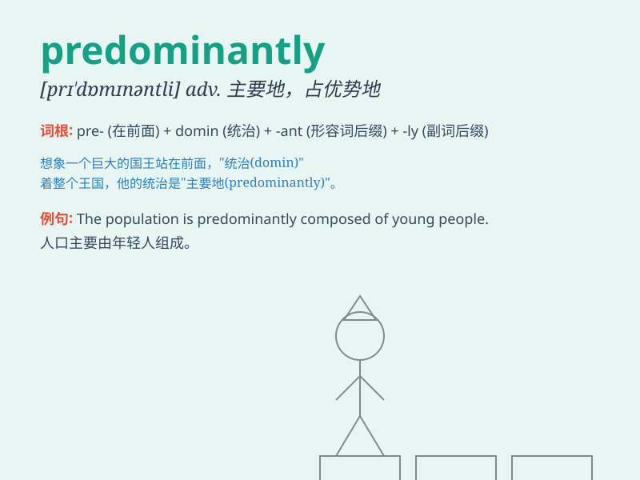

## predominantly

**英音:** _[prɪˈdɒmɪnəntli]_ **美音:**
_[prɪˈdɑːmɪnəntli]_

**译义:** *adv. 主要地；显著地；占主导地位地*

### 短语

+ **predominantly male:** _以男性为主_

+ **predominantly rural:** _以农村为主_

+ **predominantly white:** _以白人为主_

+ **predominantly positive:** _主要是积极的_

+ **predominantly economic:** _主要是经济方面的_

### 例句

#### 例句1

> **The city is predominantly industrial.**

**中文翻译:** 这座城市主要是工业性的。

**单词释义:** 主要地；占主导地位地

#### 例句2

> **The population of the area is predominantly Hispanic.**

**中文翻译:** 这个地区的人口主要是西班牙裔。

**单词释义:** 主要地；绝大多数地

#### 例句3

> **Her diet is predominantly vegetarian.**

**中文翻译:** 她的饮食主要是素食。

**单词释义:** 主要地；以......为主

### 背诵小故事

> A city was predominantly filled with tall buildings. But one small
house stood out. It was predominantly different from the rest. It showed
that \'predominantly\' means mainly or mostly.

**一个城市主要都是高楼大厦。但有一个小房子很突出。它与其他的主要不同。这表明'predominantly'意思是主要地、多半地。**

### 图义

