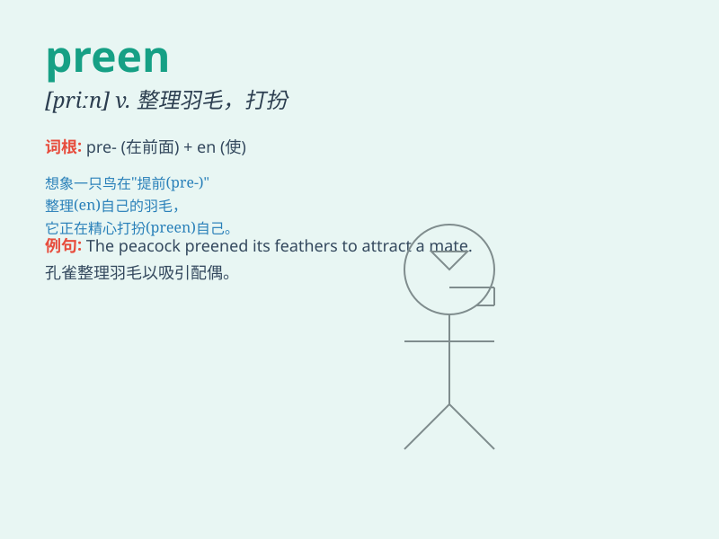

## preen

**英音:** _[priːn]_ **美音:** _[prin]_

**译义:** *vt.(鸟)用嘴整理,打扮,赞扬vi.把(自己)打扮漂亮*

### 短语

+ **preen oneself:** _自我陶醉；沾沾自喜_

+ **preen feathers:** _整理羽毛_

+ **preen for show:** _为展示而打扮_

+ **preen one\'s image:** _美化自己的形象_

+ **preen in front of the mirror:** _在镜子前打扮_

### 例句

#### 例句1

> **The bird was preening its feathers in the sunlight.**

**中文翻译:** 那只鸟在阳光下梳理羽毛。

**单词释义:** 整理（羽毛）

#### 例句2

> **She preened herself in front of the mirror before going out.**

**中文翻译:** 出门前，她在镜子前把自己打扮得漂漂亮亮的。

**单词释义:** 精心打扮

#### 例句3

> **He always preens when he gets a compliment.**

**中文翻译:** 当他受到称赞时，他总是表现得很自负。

**单词释义:** 沾沾自喜

### 背诵小故事

> A beautiful peacock was standing in the garden. It preened its
colorful feathers carefully, making them more shiny and attractive. It
wanted to show its best look to everyone.

**一只美丽的孔雀站在花园里。它仔细地梳理着自己彩色的羽毛，使它们更加闪亮迷人。它想向大家展示自己最好的模样。**

### 图义

