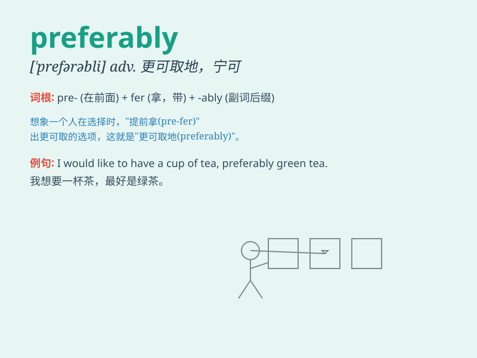

## preferably

**英音:** _[\'prefrəblɪ]_ **美音:** _[\'prɛfərəbli]_

**译义:** *adv.更适宜*

### 短语

+ **preferably with:** _最好与\...\...一起_

+ **preferably before:** _最好在\...\...之前_

+ **preferably soon:** _最好尽快_

+ **preferably today:** _最好今天_

+ **preferably in the morning:** _最好在早上_

### 例句

#### 例句1

> **I would preferably stay at home and read a book tonight.**

**中文翻译:** 今晚我宁愿呆在家里看书。

**单词释义:** 宁愿，更愿意

#### 例句2

> **Preferably, we should arrive before dark.**

**中文翻译:** 我们最好在天黑之前到达。

**单词释义:** 更可取地，更好地

#### 例句3

> **Preferably, choose organic fruits and vegetables for a healthier
diet.**

**中文翻译:** 最好选择有机水果和蔬菜以获得更健康的饮食。

**单词释义:** 最好，优先

### 背诵小故事

> One day, when choosing between two desserts, I thought, \'I would
preferably have the chocolate cake.\' It means I favored the chocolate
cake more. So, \'preferably\' shows a stronger preference or choice.

**有一天，在两种甜点之间做选择时，我想，'我更愿意要巧克力蛋糕。'这意味着我更偏爱巧克力蛋糕。所以，'preferably'表示更倾向、更愿意。**

### 图义

