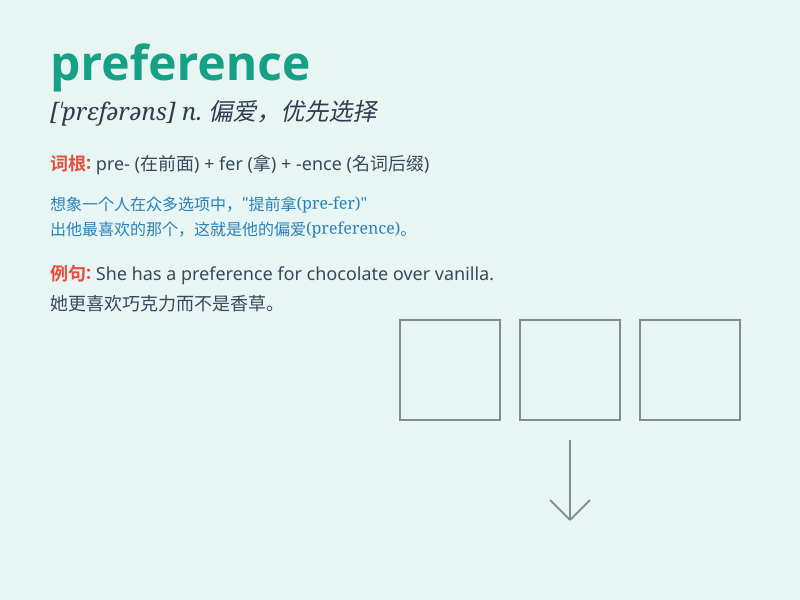

## preference

**英音:** _[\'pref(ə)r(ə)ns]_ **美音:** _[\'prɛfrəns]_

**译义:** *n.偏爱,优先选择*

### 短语

+ **preference for:** _对\...的偏爱_

+ **personal preference:** _个人偏好_

+ **consumer preference:** _消费者偏好_

+ **show preference:** _表现出偏爱_

+ **have a preference:** _有偏爱_

### 例句

#### 例句1

> **I have a preference for chocolate over vanilla.**

**中文翻译:** 与香草相比，我更喜欢巧克力。

**单词释义:** 偏爱；爱好

#### 例句2

> **Her preference in music is classical.**

**中文翻译:** 她对音乐的偏好是古典音乐。

**单词释义:** 偏好；喜好

#### 例句3

> **The company takes into account the preferences of its customers
when designing new products.**

**中文翻译:** 该公司在设计新产品时会考虑客户的偏好。

**单词释义:** 偏爱；优先选择

### 背诵小故事

> Once upon a time, a king had many choices. But he always showed a
special love for apples. This special love was his preference. It means
the choice one likes more than others.

**从前，有个国王有很多选择。但他总是特别喜欢苹果。这种特别的喜爱就是他的偏好。它指的是某人更喜欢的选择。**

### 图义

