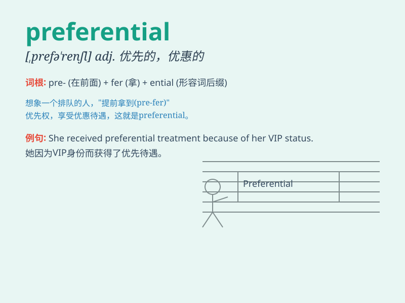

## preferential

**英音:** _[,prefə\'renʃ(ə)l]_ **美音:**
_[,prɛfə\'rɛnʃl]_

**译义:** *adj.先取的,优先的,特惠的*

### 短语

+ **preferential treatment:** _优惠待遇；优待_

+ **preferential policy:** _优惠政策_

+ **preferential trade:** _特惠贸易_

+ **preferential right:** _优先权_

+ **preferential access:** _优先进入；优先获取_

### 例句

#### 例句1

> **The company offers preferential treatment to its long-term
customers.**

**中文翻译:** 该公司为其长期客户提供优惠待遇。

**单词释义:** 优惠的；优先的

#### 例句2

> **She was given preferential access to the VIP lounge at the
airport.**

**中文翻译:** 她获得了优先进入机场贵宾室的权利。

**单词释义:** 优先的；优待的

#### 例句3

> **The new policy aims to eliminate preferential conditions for
certain industries.**

**中文翻译:** 新政策旨在取消某些行业的优惠条件。

**单词释义:** 优惠的；优先的

### 背诵小故事

> A company had a preferential policy for its long-term employees. They
got special discounts and privileges. This made others jealous, but it
was a way to show appreciation. Remember, preferential means giving
special advantages.

**一家公司对其长期员工有优惠政策。他们获得了特殊的折扣和特权。这让其他人嫉妒，但这是一种表示感谢的方式。记住，preferential
意思是给予特别的优势。**

### 图义

