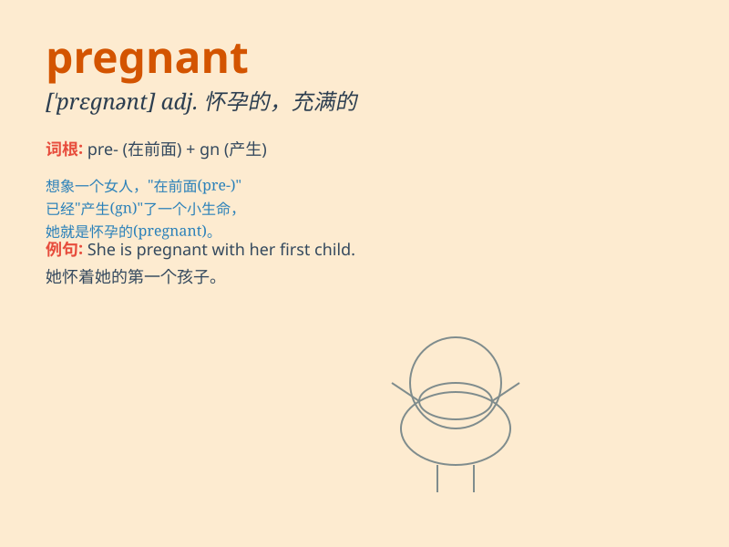

## pregnant

**英音:** _[\'pregnənt]_ **美音:** _[\'prɛɡnənt]_

**译义:** *adj.怀孕的,重要的,富有意义的,孕育的*

### 短语

+ **pregnant woman:** _孕妇_

+ **become pregnant:** _怀孕；受孕_

+ **pregnant pause:** _意味深长的停顿_

+ **pregnant with meaning:** _富有意义的_

+ **pregnant silence:** _耐人寻味的沉默_

### 例句

#### 例句1

> **She is pregnant with her first child.**

**中文翻译:** 她怀上了第一个孩子。

**单词释义:** 怀孕的

#### 例句2

> **The doctor confirmed that she was pregnant.**

**中文翻译:** 医生确认她怀孕了。

**单词释义:** 怀孕的

#### 例句3

> **A pregnant pause followed his words.**

**中文翻译:** 他的话之后出现了意味深长的停顿。

**单词释义:** 意味深长的；含蓄的

### 背诵小故事

> A woman was very happy because she was pregnant. She dreamt of
holding her baby in her arms soon. \'Pregnant\' means a woman has a baby
growing inside her body.

**一位女士非常开心，因为她怀孕了。她梦想着很快就能把宝宝抱在怀里。'pregnant'这个单词的意思是妇女怀着身孕。**

### 图义

