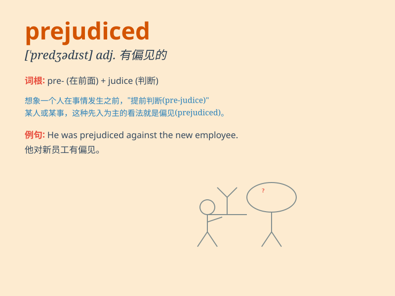

## prejudiced

**英音:** _[\'predʒədɪst]_ **美音:** _[\'prɛdʒədɪst]_

**译义:** *adj.怀偏见的*

### 短语

+ **be prejudiced against:** _对\...\...有偏见_

+ **prejudiced opinion:** _偏见的看法_

+ **prejudiced judgment:** _有偏见的判断_

+ **prejudiced attitude:** _偏见的态度_

+ **deeply prejudiced:** _极度偏见的_

### 例句

#### 例句1

> **He is prejudiced against people from other cultures.**

**中文翻译:** 他对来自其他文化的人有偏见。

**单词释义:** 有成见的；有偏见的

#### 例句2

> **Her views on this matter are prejudiced and not based on
facts.**

**中文翻译:** 她对此事的看法是有偏见的，没有事实依据。

**单词释义:** 偏见的；不公平的

#### 例句3

> **The jury was prejudiced by the media coverage of the case.**

**中文翻译:** 陪审团因媒体对此案的报道而产生偏见。

**单词释义:** 使有成见；使有偏见

### 背诵小故事

> A person always judged others based on their appearance and
background. This made him prejudiced. He missed many chances to know
wonderful people. Finally, he realized his mistake and changed.

**一个人总是根据他人的外表和背景来评判他们。这让他充满偏见。他因此错过了很多结识优秀之人的机会。最终，他意识到了自己的错误并做出了改变。**

### 图义

