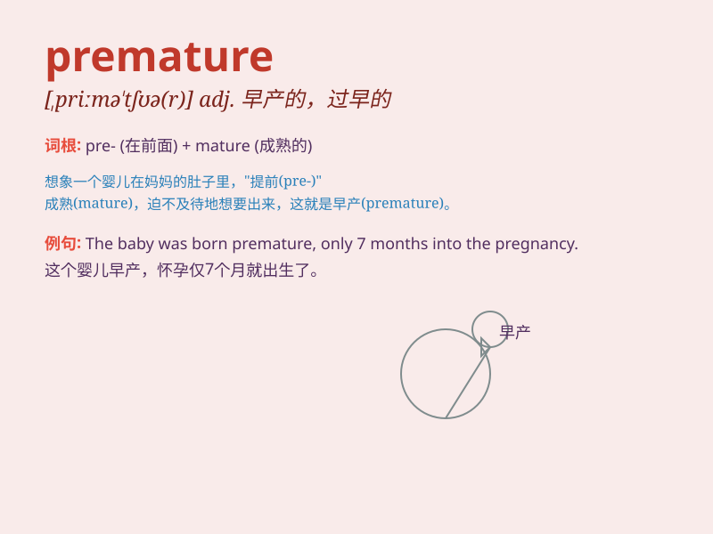

## premature

**英音:** _[\'premətjʊə]_ **美音:** _[,primə\'tʃʊr]_

**译义:** *adj.未成熟的,太早的,早熟的*

### 短语

+ **premature birth:** _早产_

+ **premature death:** _过早死亡；夭折_

+ **premature ejaculation:** _早泄_

+ **premature aging:** _过早衰老_

+ **premature retirement:** _提前退休_

### 例句

#### 例句1

> **The baby was born premature and needed special care.**

**中文翻译:** 这个婴儿早产了，需要特殊护理。

**单词释义:** 早产的

#### 例句2

> **His decision to quit the job was premature.**

**中文翻译:** 他辞职的决定为时过早。

**单词释义:** 过早的；提前的

#### 例句3

> **The premature aging of her skin was due to excessive sun
exposure.**

**中文翻译:** 她皮肤的过早老化是由于过度日晒造成的。

**单词释义:** 过早的；提前的

### 背诵小故事

> A baby was born prematurely. The parents were very worried. But with
the care of doctors, the baby grew stronger. \'Premature\' means
happening before the proper or usual time.

**一个婴儿早产了。父母非常担心。但在医生的照料下，婴儿变得更强壮了。\'premature\'意思是在恰当或通常的时间之前发生。**

### 图义

